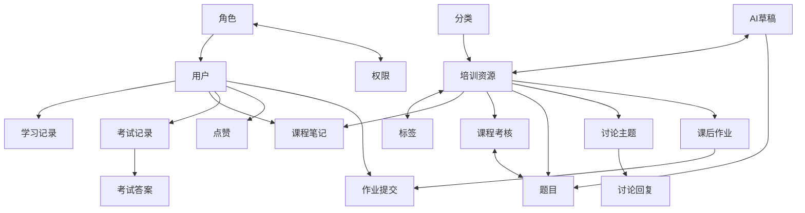

# CareNexus 轻量版 CDM 说明

项目名称：CareNexus 颐联  
更新时间：2026-07-15  
状态：待生成 PowerDesigner CDM

## 1. 建模目标

CDM 用于表达轻量版核心业务实体和关系，不绑定 MySQL 字段类型、索引和具体外键名。模型只覆盖管理员与护工培训主线。

## 2. 概念实体

### 账号与权限

- 用户
- 角色
- 权限
- 字典

### 培训资源

- 培训分类
- 培训标签
- 培训资源
- 文件资源

### 学习与考核

- 学习汇总
- 学习访问
- 课程笔记
- 课程考核
- 题目
- 题目选项
- 考试记录
- 考试答案

### AI

- AI 题目草稿
- 草稿来源课程

### 互动与作业

- 讨论主题
- 讨论回复
- 主题点赞
- 回复点赞
- 课后作业
- 作业提交

### 审计

- 操作日志

## 3. 核心关系

- 一个角色拥有多个用户。
- 角色与权限为多对多。
- 一个分类包含多个培训资源。
- 资源与标签为多对多。
- 一个用户拥有多条学习访问、考试记录和课程笔记。
- 用户与课程之间最多一份笔记。
- 一门课程最多一份考核。
- 一门课程可以有多道题目。
- 考核与题目通过关联关系组成试卷。
- 一次考试记录包含多条逐题答案。
- AI 草稿可以引用多门课程，审核通过可追踪到一条正式题目。
- 一门课程包含多个讨论主题、回复和作业。
- 用户对同一主题或回复最多点赞一次。
- 用户对同一作业最多保留一个提交关系。

## 4. 概念关系图

## 5. 业务边界

CDM 不包含：

- 老人和家属。
- 护理地址、服务项目、预约和订单。
- 订单分配、执行、评价和投诉。
- 医生授权、健康档案、健康记录、预警、随访、干预和评估。
- 医疗诊断与处方。

## 6. 生成要求

- 模型名称建议：`CareNexus-Lite`。
- 采用中文实体名和清晰业务关系名。
- 关系基数与最终数据库约束一致。
- 将关联表抽象为多对多关系或关联实体，保持可读性。
- 讨论回复需表达自关联父回复。
- 模型图片按领域分区，避免 28 张表物理细节直接挤入 CDM。

## 7. 验收

- 实体范围与轻量版需求一致。
- 所有核心关系可以追踪到最终 PDM 表。
- 不出现完整版已删除实体。
- 与软件需求规约、用例模型和数据库设计一致。
- 生成 `.cdm` 和清晰 PNG 后才能将该成果标记为完成。