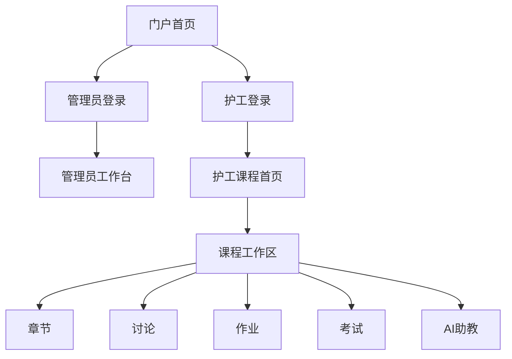

# CareNexus Lite 原型与页面地图

## 门户端

- 首页：品牌、项目理念、培训能力和角色入口。
- 理念介绍页：资料管理、学习记录、知识考核和AI辅助。
- AI能力页：资料问答、总结、建议、练习和安全边界。

## 管理员端

- 工作台。
- 培训资源列表、筛选、详情和编辑。
- 分类与标签管理。
- 题库与考试管理。
- AI题目草稿审核。
- 护工培训成绩。

## 护工端

- 课程首页和课程工作区。
- 章节资料、讨论、作业、考试、错题、学习记录和AI助教。
- 学习进度、学习笔记和个人账号。

页面以可操作工作台为主，不使用说明文字替代真实功能；空数据场景通过演示数据保证答辩时可展示。
