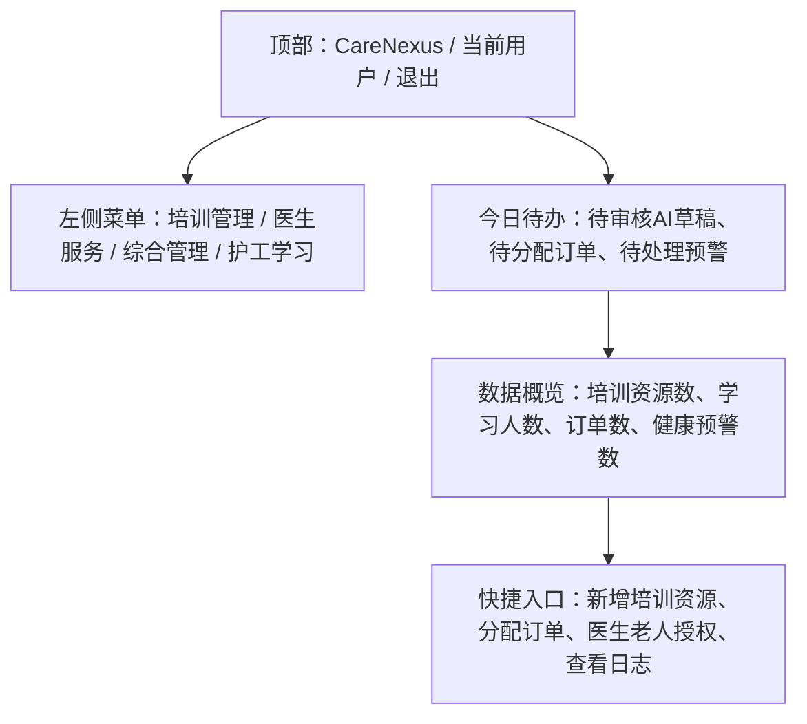
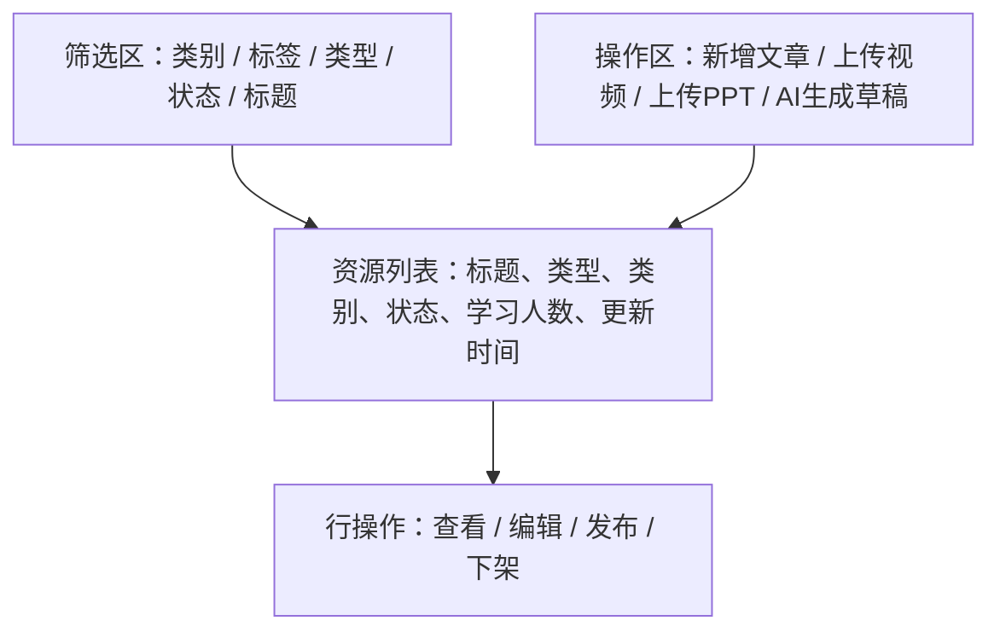
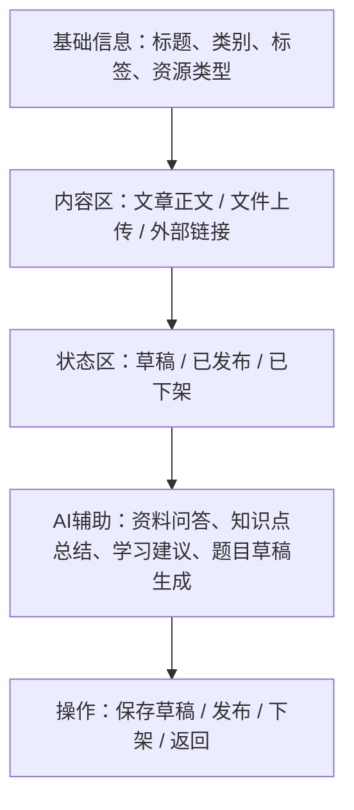
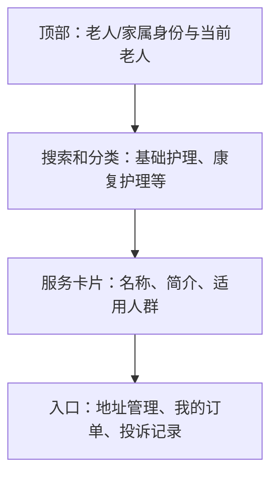
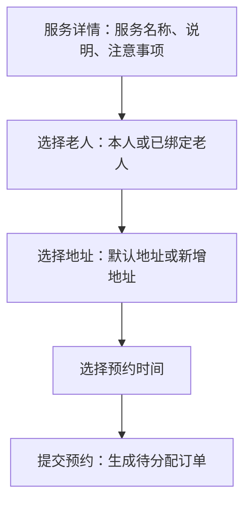
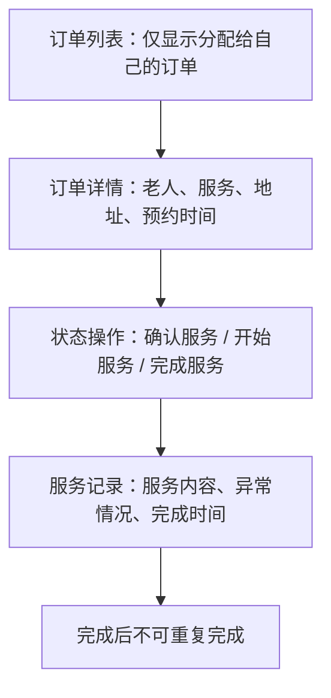
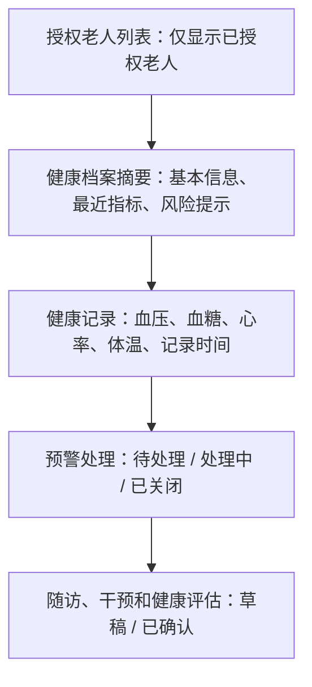

# 原型设计

项目名称：CareNexus 颐联

任务编号：T-011

文档状态：已审核，T-011封板

更新时间：2026-07-09

本文档记录 T-011 阶段的低保真页面原型。原型用于说明页面信息结构和主要入口，不代表已经实现完整业务功能。

## 1. PC首页

## 2. 培训资源一级页面

## 3. 培训资源编辑或详情二级页面

## 4. 移动端服务首页

## 5. 服务详情或预约页面

## 6. 护工订单执行页面

## 7. 医生健康档案页面

## 8. 当前Vue静态原型位置

- PC 首页和培训、医生、综合管理入口位于 `frontend/admin-web/`。
- 移动端服务首页、服务预约、订单执行和移动培训入口位于 `frontend/mobile-web/`。
- 当前页面仅用于展示信息结构和路由骨架，不包含真实接口联调或完整业务逻辑。
