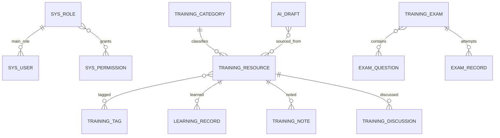

# CareNexus Lite 数据库设计

## 当前领域

1. 账号权限：用户、角色、权限、角色权限。
2. 培训内容：分类、标签、资源、资源标签。
3. 学习互动：访问记录、学习记录、笔记、讨论、回复、点赞、作业及提交。
4. 考核：题目、选项、考试、考试题目、考试记录、答案。
5. AI：题目草稿、草稿资料关系。
6. 文件与审计：文件资源、操作日志。

实际结构以 `database/init/001_schema.sql` 及后续 `003` 至 `007` 增量脚本为准，演示数据以 `002`、`005`、`006`、`007`、`008` 为准。

## 关键关系

## 约束与策略

- 字符集使用 `utf8mb4`，演示中文数据避免乱码。
- 主键使用自增 `BIGINT`；必要关系建立外键和唯一约束。
- 用户只有一个主要角色 `main_role_id`，不维护第二套角色事实源。
- 资源、分类、标签等主数据按实际表字段使用状态或逻辑删除；学习和考试历史不随资源下架删除。
- 学习记录按用户和资源唯一聚合；考试记录用作答序号保留历史。
- AI草稿通过关系表关联一个或多个来源资源。
- 课程封面保存可访问URL；文件元数据与实际存储路径分离。

## 数据脚本顺序

按文件名前缀顺序执行 `001` 至 `008`。脚本包含本地演示账户和示例课程，禁止用于生产环境。PowerDesigner模型按 T-030 在最终SQL稳定后人工生成。
