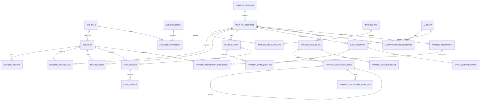

# 数据库设计

项目名称：CareNexus 颐联  
版本：轻量版 2.0  
更新时间：2026-07-15  
数据库：MySQL 8

## 1. 设计基线

数据库以 `database/init/` 下 001–008 顺序脚本为唯一实现基线。当前最终结构共 28 张表，而不是早期完整版的 36 张，也不是轻量版初次收敛时记录的 21/22 张。

脚本顺序：

1. `001_schema.sql`：22 张核心表、索引和外键。
2. `002_seed_data.sql`：角色、权限、演示账号、课程、题库和考核数据。
3. `003_add_account_course_images.sql`：账号头像和课程封面字段兼容调整。
4. `004_course_interactions.sql`：讨论、回复、作业和提交 4 张表。
5. `005_demo_learning_progress.sql`：演示学习与成绩数据。
6. `006_multi_question_assignments.sql`：多题型课后作业演示数据。
7. `007_social_discussions.sql`：嵌套回复及 2 张点赞表。
8. `008_demo_showcase_data.sql`：答辩展示数据。

## 2. 数据域与表清单

### 2.1 账号与权限（5 张）

| 表 | 用途 |
|---|---|
| `sys_role` | 角色定义，当前为 ADMIN、CAREGIVER |
| `sys_permission` | 功能权限码 |
| `sys_user` | 用户账号、密码哈希、主角色和状态 |
| `sys_role_permission` | 角色与权限关系 |
| `sys_dict` | 培训资源类型、存储方式等基础字典 |

### 2.2 审计与文件（2 张）

| 表 | 用途 |
|---|---|
| `operation_log` | 关键操作审计 |
| `file_resource` | 上传文件元数据和相对路径 |

### 2.3 培训资源与学习（7 张）

| 表 | 用途 |
|---|---|
| `training_category` | 培训分类 |
| `training_tag` | 培训标签 |
| `training_resource` | 课程资源及状态 |
| `training_resource_tag` | 资源标签多对多关系 |
| `learning_record` | 用户整体学习汇总 |
| `learning_access_log` | 每次课程访问记录 |
| `training_note` | 用户与课程唯一的富文本笔记 |

### 2.4 题库与考核（6 张）

| 表 | 用途 |
|---|---|
| `training_exam` | 每门课程对应的考核 |
| `exam_question` | 单选题或判断题 |
| `exam_question_option` | 单选题选项 |
| `training_exam_question` | 考核题目关系和分值 |
| `exam_record` | 用户一次考试尝试 |
| `exam_answer` | 一次考试中的逐题答案和得分 |

### 2.5 AI（2 张）

| 表 | 用途 |
|---|---|
| `ai_draft` | AI 题目草稿、状态和审核信息 |
| `ai_draft_source_resource` | 草稿与来源课程的多对多关系 |

### 2.6 互动与作业（6 张）

| 表 | 用途 |
|---|---|
| `training_discussion` | 课程讨论主题 |
| `training_discussion_reply` | 主题回复和嵌套回复 |
| `training_discussion_like` | 用户对主题的点赞关系 |
| `training_discussion_reply_like` | 用户对回复的点赞关系 |
| `training_assignment` | 课程课后作业 |
| `training_assignment_submission` | 用户作业提交 |

合计：5 + 2 + 7 + 6 + 2 + 6 = 28 张表。

## 3. 核心关系



## 4. 关键约束

### 4.1 账号与权限

- `sys_user.username` 唯一。
- `sys_user.main_role_id` 指向 `sys_role`。
- `sys_role_permission(role_id, permission_id)` 唯一。
- 密码仅保存 BCrypt 哈希。
- `account_status` 控制账号是否可用，`is_deleted` 用于逻辑删除。

### 4.2 培训资源

- 资源类型：`ARTICLE`、`VIDEO`、`PPT`。
- 存储方式：`TEXT`、`LOCAL_FILE`、`EXTERNAL_LINK`。
- 状态：`DRAFT`、`PUBLISHED`、`OFFLINE`。
- `training_resource_tag(resource_id, tag_id)` 唯一，避免重复标签。
- 文件、外链和文本字段由业务层根据存储方式互斥校验。

### 4.3 学习与笔记

- `learning_record(user_id, training_scope)` 唯一。
- `training_note(user_id, resource_id)` 唯一。
- 笔记正文使用 `LONGTEXT` 保存富文本 HTML。
- 学习时长通过访问日志累计，不接受前端直接写入最终培训状态。

### 4.4 题库与考核

- `training_exam.resource_id` 唯一，实现一课一考核。
- `exam_question.resource_id` 将题目绑定到来源课程。
- `exam_question_option(question_id, option_label)` 唯一。
- `training_exam_question(exam_id, question_id)` 唯一。
- `exam_record(user_id, exam_id, attempt_no)` 唯一。
- `exam_answer(exam_record_id, question_id)` 唯一。
- 仅支持单选题和判断题；业务层拒绝 `SHORT_ANSWER`。

### 4.5 AI 草稿

- `ai_draft` 保存草稿 JSON、状态和审核信息。
- `ai_draft_source_resource(draft_id, resource_id)` 唯一。
- 审核通过创建的正式题目通过 `source_ai_draft_id` 追踪来源。
- 草稿只能从 `DRAFT` 进入 `APPROVED` 或 `REJECTED`。

### 4.6 讨论与作业

- 回复通过 `parent_reply_id` 支持嵌套关系。
- 点赞表均使用“内容 ID + 用户 ID”唯一键。
- 作业提交使用 `(assignment_id, user_id)` 唯一键。
- 删除讨论或回复前由业务层校验作者身份。

## 5. 索引设计

重点索引：

- 用户账号：用户名唯一、角色和状态索引。
- 培训资源：分类+状态、类型+状态。
- 学习访问：用户+访问时间。
- 考试记录：用户+提交时间。
- AI 草稿：草稿状态。
- 讨论：课程+创建时间。
- 回复：主题+创建时间、父回复索引。
- 点赞与作业提交：唯一关系索引。

分页和成绩查询新增条件时，应结合真实执行计划调整索引，不仅凭字段数量创建组合索引。

## 6. 状态字段

| 领域 | 字段 | 主要值 |
|---|---|---|
| 角色 | `role_status` | ENABLED / DISABLED |
| 账号 | `account_status` | NORMAL / DISABLED |
| 分类/标签 | `*_status` | ENABLED / DISABLED |
| 资源 | `resource_status` | DRAFT / PUBLISHED / OFFLINE |
| 学习 | `training_status` | NOT_STARTED / LEARNING / PASSED 等代码实际值 |
| 考核 | `exam_status` | DRAFT / PUBLISHED |
| 考试结果 | `pass_status` | PASSED / NOT_PASSED |
| AI 草稿 | `draft_status` | DRAFT / APPROVED / REJECTED |
| 作业 | `assignment_status` | PUBLISHED 等 |
| 提交 | `submission_status` | SUBMITTED 等 |

状态值应由后端常量和业务服务维护，前端不自行创造新值。

## 7. 数据安全

- 数据库密码仅通过环境变量提供。
- 不保存明文密码、Token 或 AI Key。
- 当前轻量版不再保存医生健康档案或护理订单敏感数据。
- 手机字段保留密文和尾号设计，但现行培训主线不依赖完整联系方式。
- 文件表只保存相对路径，不把服务器绝对路径返回客户端。

## 8. 初始化与迁移

全新环境必须依次执行 001–008。部分脚本包含 `ALTER TABLE` 和演示数据，不能跳序执行。

建议交付验证：

```sql
SELECT COUNT(*) FROM information_schema.tables
WHERE table_schema = 'care_nexus';
```

预期最终表数量：28。

还应检查：

- 所有外键成功创建。
- 两个角色和五个权限码存在。
- 演示账号存在且密码为哈希。
- 三门演示课程及逐课考核存在。
- 互动、作业、笔记和 AI 演示数据无乱码。

## 9. PowerDesigner 模型

最终 CDM/PDM 必须基于 28 张表生成。早期完整版 36 表说明不得复用。输出文件计划：

- `CareNexus-Lite.cdm`
- `CareNexus-Lite.pdm`
- `CareNexus-Lite-CDM.png`
- `CareNexus-Lite-PDM.png`

模型文件尚未在仓库中生成，不能把说明文档视为已完成模型成果。

## 10. 变更规则

任何表结构变更必须：

1. 新增或调整顺序 SQL 脚本。
2. 更新 Entity、Mapper 和业务校验。
3. 更新数据字典、数据库设计和 README。
4. 在干净 MySQL 8 环境执行验证。
5. 将实际命令、结果和问题追加到 `TEST_LOG.md`。
6. 如改变对外数据结构，同步更新 API 文档和前端。