# 数据库设计

项目名称：CareNexus 颐联

任务编号：T-011

文档状态：已审核，T-011封板

更新时间：2026-07-09

## 1. 设计范围

本文档基于需求基线 v1.0，设计 MVP 阶段数据库领域、实体关系、表清单、字段原则、约束、索引和敏感数据处理策略。

本设计不使用真实个人隐私数据，不提交真实密码、Token 或密钥。

## 2. 领域划分

| 领域 | 主要表数量 | 说明 |
|---|---:|---|
| 用户权限、授权与审计 | 9 | 用户、角色、权限、字典、日志、老人绑定和医生授权 |
| 文件资源 | 1 | 文件元数据 |
| 培训与 AI | 14 | 培训资源、标签、学习、考核、题目、选项、AI草稿和多资料来源关系 |
| 护理服务 | 7 | 服务项目、地址、订单、服务记录、评价、投诉 |
| 医生健康管理 | 5 | 健康记录、预警、随访、干预、评估 |
| 合计 | 36 | MVP 初始表清单 |

## 3. 实体关系图

```mermaid
erDiagram
    SYS_ROLE ||--o{ SYS_USER : mainRole
    SYS_ROLE ||--o{ SYS_ROLE_PERMISSION : grants
    SYS_PERMISSION ||--o{ SYS_ROLE_PERMISSION : belongs
    SYS_USER ||--o{ DOCTOR_ELDER_AUTHORIZATION : doctor
    ELDER_PROFILE ||--o{ DOCTOR_ELDER_AUTHORIZATION : elder
    ELDER_PROFILE ||--o{ ELDER_FAMILY_BINDING : elder
    SYS_USER ||--o{ ELDER_FAMILY_BINDING : family
    TRAINING_RESOURCE ||--o{ TRAINING_RESOURCE_TAG : tagged
    TRAINING_TAG ||--o{ TRAINING_RESOURCE_TAG : tag
    SYS_USER ||--o{ LEARNING_RECORD : learns
    TRAINING_RESOURCE ||--o{ LEARNING_ACCESS_LOG : visited
    TRAINING_EXAM ||--o{ TRAINING_EXAM_QUESTION : contains
    EXAM_QUESTION ||--o{ TRAINING_EXAM_QUESTION : used
    EXAM_QUESTION ||--o{ EXAM_QUESTION_OPTION : options
    TRAINING_EXAM ||--o{ EXAM_RECORD : records
    EXAM_QUESTION ||--o{ EXAM_ANSWER : answered
    EXAM_RECORD ||--o{ EXAM_ANSWER : has
    AI_DRAFT ||--o{ AI_DRAFT_SOURCE_RESOURCE : has
    TRAINING_RESOURCE ||--o{ AI_DRAFT_SOURCE_RESOURCE : source
    ELDER_PROFILE ||--o{ CARE_ORDER : receives
    CARE_ORDER ||--o{ CARE_ORDER_STATUS_LOG : changes
    CARE_ORDER ||--o| CARE_SERVICE_RECORD : completes
    CARE_ORDER ||--o| CARE_ORDER_EVALUATION : evaluates
    CARE_ORDER ||--o| CARE_ORDER_COMPLAINT : complains
    ELDER_PROFILE ||--o{ HEALTH_RECORD : has
    HEALTH_RECORD ||--o{ HEALTH_ALERT : triggers
    ELDER_PROFILE ||--o{ FOLLOW_UP_RECORD : follows
    ELDER_PROFILE ||--o{ INTERVENTION_RECORD : intervenes
    ELDER_PROFILE ||--o{ HEALTH_ASSESSMENT : assesses
```



## 4. 主键和外键策略

- 主键统一使用 `BIGINT AUTO_INCREMENT`。
- 核心关联字段使用物理外键约束，例如 `user_id`、`elder_id`、`doctor_id`、`exam_id`、`order_id`。
- `sys_user.main_role_id` 是 MVP 阶段用户主要业务角色的唯一数据源，关联 `sys_role.id`。
- MVP 阶段不设置 `sys_user_role` 多角色关系表，避免主角色和用户角色关系出现两个需要人工同步的数据源。
- `sys_role_permission` 继续维护 RBAC 功能权限。
- 老人账号通过 `elder_profile.user_id` 定位老人档案，该字段可为空且非空唯一。
- 关系历史变化通过操作日志或后续历史表记录，不通过在唯一键中加入状态字段规避冲突。
- 业务状态合法性由 Service 层校验，物理层通过外键、唯一约束和索引保护基础一致性。

## 5. 通用字段

主数据表建议包含：

| 字段 | 说明 |
|---|---|
| `id` | 主键 |
| `created_at` | 创建时间 |
| `updated_at` | 更新时间 |
| `created_by` | 创建人 |
| `updated_by` | 更新人 |
| `is_deleted` | 逻辑删除标记，适用于主数据 |

业务流水、日志、记录类表可不使用逻辑删除。

## 6. 状态字段

| 对象 | 状态字段 | 值 |
|---|---|---|
| 培训资源 | `resource_status` | `DRAFT`、`PUBLISHED`、`OFFLINE` |
| 培训学习 | `training_status` | `NOT_STARTED`、`LEARNING`、`EXAM_TAKEN`、`PASSED`、`NOT_PASSED` |
| AI草稿 | `draft_status` | `DRAFT`、`APPROVED`、`REJECTED` |
| 护理订单 | `order_status` | `PENDING_ASSIGN`、`PENDING_CONFIRM`、`CONFIRMED`、`IN_SERVICE`、`COMPLETED`、`CANCELLED` |
| 评价 | 来源于 `care_order_evaluation` | 无评价记录表示未评价；存在评价记录表示已评价 |
| 投诉 | `care_order_complaint.complaint_status` | 无投诉记录表示未投诉；投诉记录状态为 `PROCESSING`、`PROCESSED` |
| 健康预警 | `alert_status` | `PENDING`、`PROCESSING`、`CLOSED` |
| 健康评估 | `assessment_status` | `DRAFT`、`CONFIRMED` |
| 账号 | `account_status` | `NORMAL`、`DISABLED` |

## 7. 表清单

| 表名 | 领域 | 说明 |
|---|---|---|
| `sys_user` | 用户权限 | 系统用户和主要业务角色 |
| `sys_role` | 用户权限 | 角色 |
| `sys_permission` | 用户权限 | 权限项 |
| `sys_role_permission` | 用户权限 | 角色权限关系 |
| `sys_dict` | 用户权限 | 基础字典 |
| `operation_log` | 审计 | 操作日志 |
| `elder_profile` | 用户权限/健康 | 老人档案 |
| `elder_family_binding` | 用户权限 | 老人家属绑定 |
| `doctor_elder_authorization` | 用户权限/健康 | 医生老人授权 |
| `training_category` | 培训 | 培训类别 |
| `training_tag` | 培训 | 培训标签 |
| `training_resource` | 培训 | 文章、视频、PPT |
| `training_resource_tag` | 培训 | 资源标签关系 |
| `learning_record` | 培训 | 用户整体学习记录 |
| `learning_access_log` | 培训 | 资源访问历史 |
| `training_exam` | 培训 | 培训考核 |
| `exam_question` | 培训 | 考核题目，使用 `resource_id` 关联所属培训资源 |
| `exam_question_option` | 培训 | 客观题选项 |
| `training_exam_question` | 培训 | 考核题目关系 |
| `exam_record` | 培训 | 考核记录 |
| `exam_answer` | 培训 | 考核答案 |
| `ai_draft` | 培训AI | AI 生成草稿 |
| `ai_draft_source_resource` | 培训AI | AI草稿来源培训资料关系 |
| `care_service_item` | 护理服务 | 服务项目 |
| `care_address` | 护理服务 | 服务地址 |
| `care_order` | 护理服务 | 护理订单 |
| `care_order_status_log` | 护理服务 | 订单状态日志 |
| `care_service_record` | 护理服务 | 服务完成记录 |
| `care_order_evaluation` | 护理服务 | 评价 |
| `care_order_complaint` | 护理服务 | 投诉 |
| `health_record` | 医生服务 | 健康记录 |
| `health_alert` | 医生服务 | 健康预警 |
| `follow_up_record` | 医生服务 | 随访记录 |
| `intervention_record` | 医生服务 | 干预记录 |
| `health_assessment` | 医生服务 | 健康评估 |
| `file_resource` | 文件 | 文件元数据 |

## 8. 唯一约束和索引建议

| 表 | 约束或索引 |
|---|---|
| `sys_user` | `uk_username`、`idx_main_role`、`idx_account_status` |
| `elder_profile` | `uk_elder_profile_user` |
| `elder_family_binding` | `uk_elder_family`，不包含状态字段 |
| `doctor_elder_authorization` | `uk_doctor_elder`，不包含状态字段；`idx_elder_id` |
| `training_resource` | `idx_category_status`、`idx_resource_type_status` |
| `learning_record` | `uk_user_training_scope` |
| `exam_record` | `uk_exam_record_attempt(user_id, exam_id, attempt_no)` |
| `ai_draft_source_resource` | `uk_ai_draft_source_resource(draft_id, resource_id)` |
| `care_order` | `idx_order_status`、`idx_elder_id`、`idx_assigned_caregiver_id` |
| `health_record` | `idx_elder_record_time` |
| `health_alert` | `idx_elder_status` |
| `operation_log` | `idx_operator_time` |

## 9. 敏感数据处理

- `sys_user.password_hash` 只保存密码哈希。
- 联系电话按受控保存字段设计：数据库保存密文或受控字段 `mobile_cipher_text` / `contact_mobile_cipher_text`，展示只使用尾号或按规则脱敏。
- 不保存明文 Token、真实密钥或真实数据库密码。
- 日志表不保存完整手机号、身份证号或完整健康隐私。
- 健康记录页面和日志输出需要脱敏策略。
- 初始化数据使用演示账号和占位密码哈希。

## 10. T-010 设计依赖

| 项目 | 数据库设计处理 |
|---|---|
| 考核重考规则 | `training_exam.max_attempts` 记录上限，`exam_record.attempt_no` 记录第几次考试，`uk_exam_record_attempt` 防止同一用户同一考核同一次数重复 |
| 健康记录必填字段 | `elder_id`、`record_time` 必填；血压、血糖、心率、体温至少一项由业务校验保证 |
| 文件白名单和大小 | 由配置和文件服务校验，`file_resource` 保存类型和大小 |
| 基础性能目标 | 核心列表增加分页索引，执行测试时记录响应时间 |

## 11. CDM/PDM 模型成果

模型成果目录：

```text
database/model/
```

当前已提供：

- `database/model/README.md`
- `database/model/CDM说明.md`
- `database/model/PDM说明.md`

PowerDesigner 模型和截图已拆分为 T-030 / Issue #2，最终交付前由项目负责人基于最终版 SQL 手动生成。当前不得提交伪造模型文件。

## 12. 初始化脚本

初始脚本位置：

```text
database/init/001_schema.sql
database/init/002_seed_data.sql
database/dict/data-dictionary.md
```

脚本只包含结构和演示规划数据，不包含真实隐私。

## 13. MySQL 实际验证结果

2026-07-09 使用临时 MySQL 8 实例执行 `database/init/001_schema.sql` 和 `database/init/002_seed_data.sql`，验证结果如下：

| 项目 | 结果 |
|---|---:|
| 实际表数量 | 36 |
| 外键数量 | 54 |
| 唯一约束数量 | 17 |

本次验证确认 `sys_user_role` 已从物理模型中删除，`ai_draft_source_resource` 已作为 AI 草稿多资料来源关系表创建。
