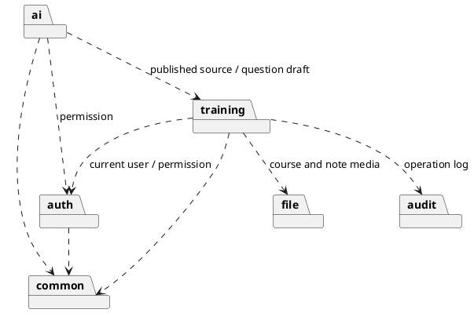
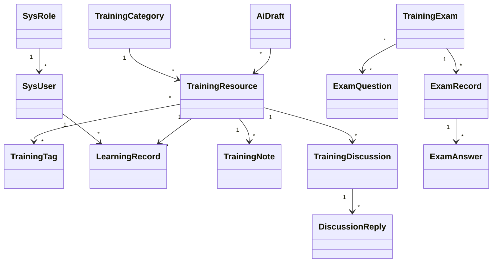
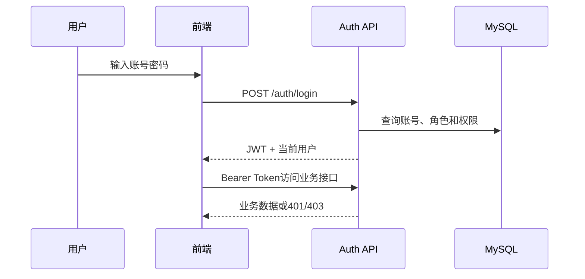
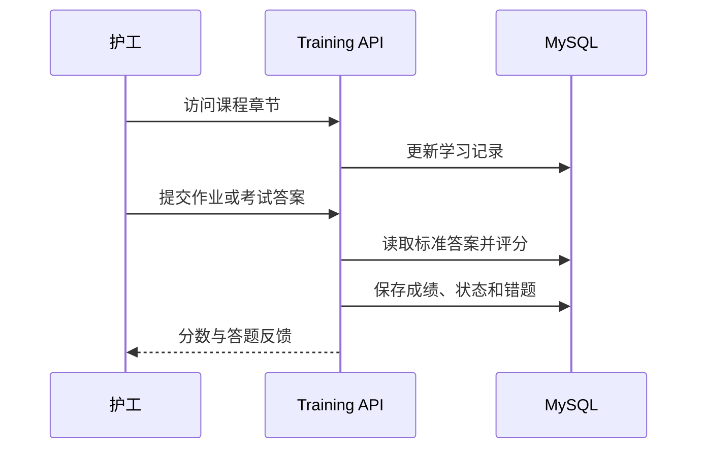

# CareNexus Lite 系统分析与设计模型

## 包图

```plantuml
@startuml
package common
package auth
package training
package ai
package file
package audit
training ..> auth : current user / permission
training ..> file : course and note media
training ..> audit : operation log
ai ..> training : published source / question draft
ai ..> auth : permission
auth ..> common
training ..> common
ai ..> common
@enduml
```

## 核心类关系

```mermaid
classDiagram
  SysRole "1" --> "*" SysUser
  TrainingCategory "1" --> "*" TrainingResource
  TrainingResource "*" --> "*" TrainingTag
  SysUser "1" --> "*" LearningRecord
  TrainingResource "1" --> "*" LearningRecord
  TrainingResource "1" --> "*" TrainingNote
  TrainingResource "1" --> "*" TrainingDiscussion
  TrainingDiscussion "1" --> "*" DiscussionReply
  TrainingExam "*" --> "*" ExamQuestion
  TrainingExam "1" --> "*" ExamRecord
  ExamRecord "1" --> "*" ExamAnswer
  AiDraft "*" --> "*" TrainingResource
```

## 登录时序

```mermaid
sequenceDiagram
  participant U as 用户
  participant F as 前端
  participant A as Auth API
  participant DB as MySQL
  U->>F: 输入账号密码
  F->>A: POST /auth/login
  A->>DB: 查询账号、角色和权限
  A-->>F: JWT + 当前用户
  F->>A: Bearer Token访问业务接口
  A-->>F: 业务数据或401/403
```

## 学习考核时序

```mermaid
sequenceDiagram
  participant C as 护工
  participant T as Training API
  participant DB as MySQL
  C->>T: 访问课程章节
  T->>DB: 更新学习记录
  C->>T: 提交作业或考试答案
  T->>DB: 读取标准答案并评分
  T->>DB: 保存成绩、状态和错题
  T-->>C: 分数与答题反馈
```
