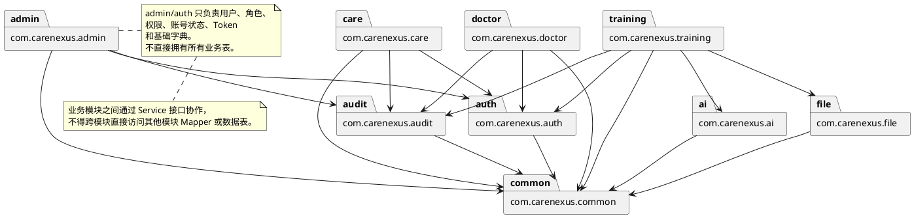
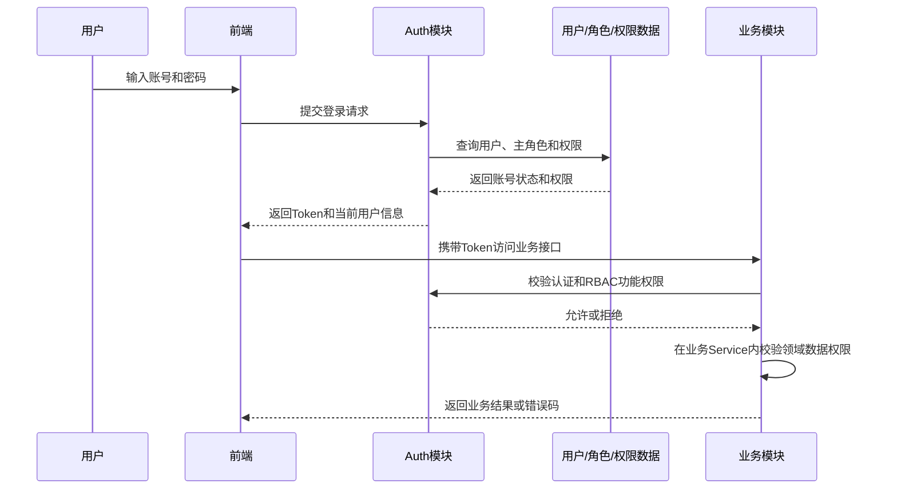
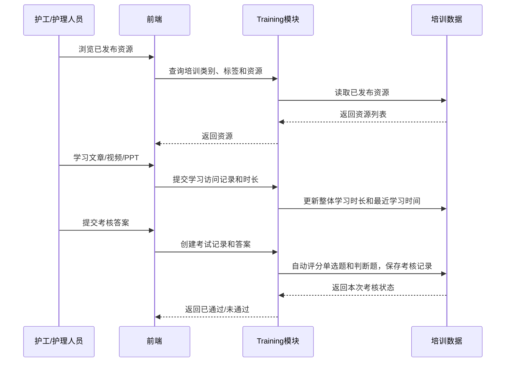
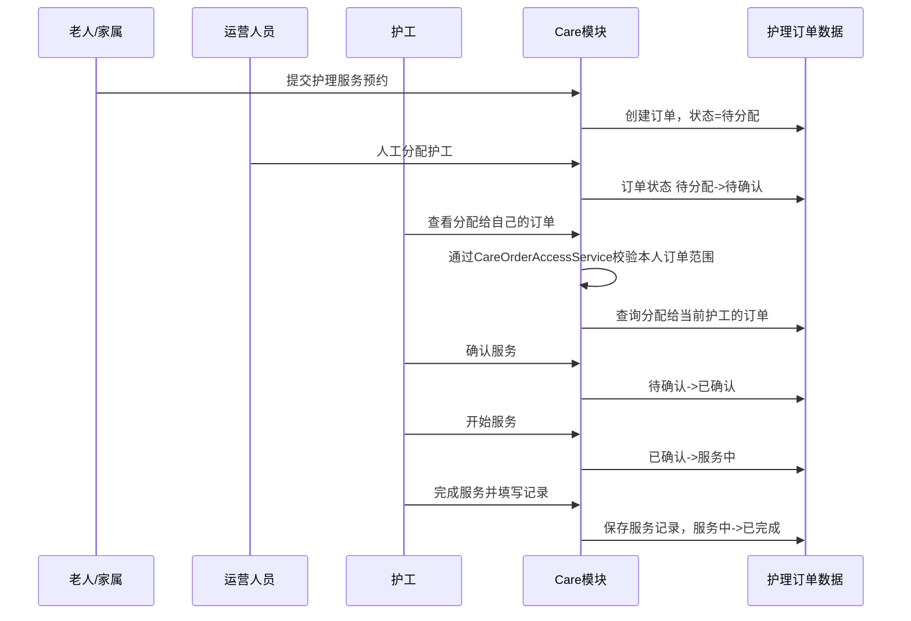
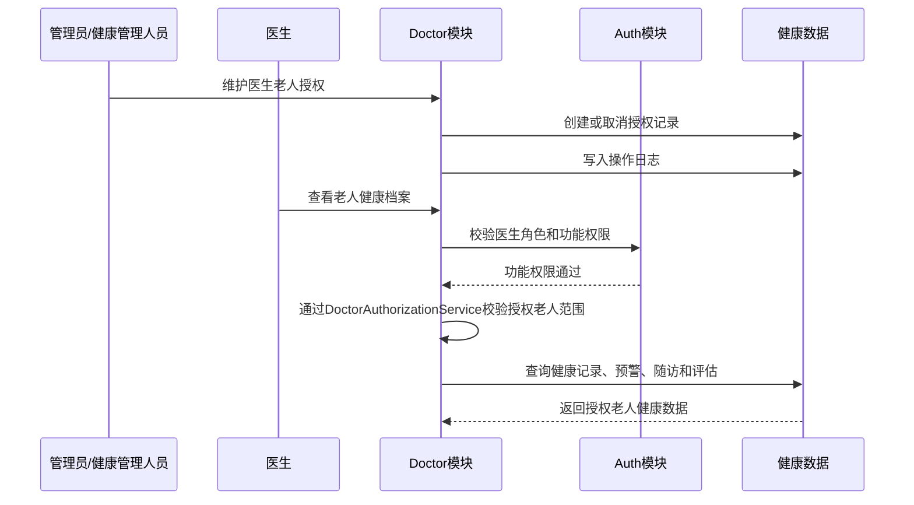
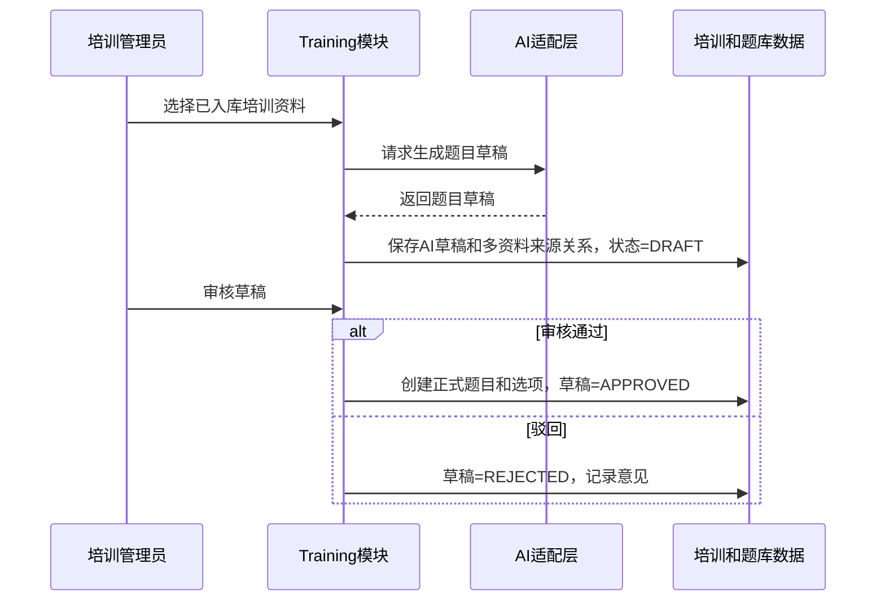
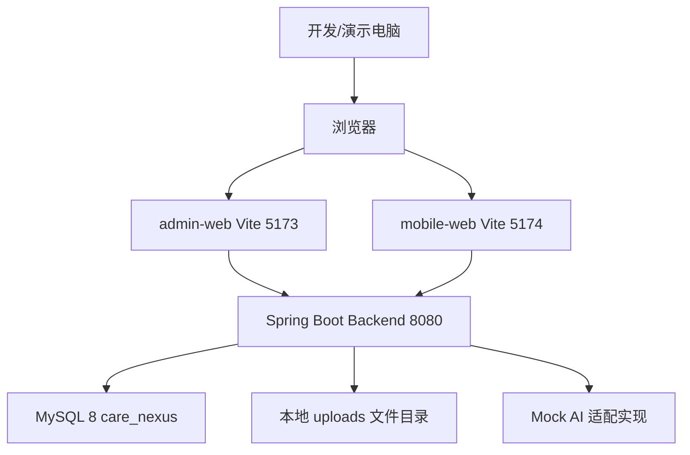
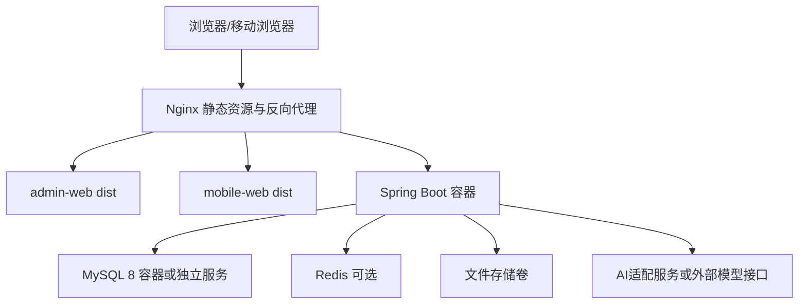

# 系统分析与设计模型

项目名称：CareNexus 颐联

任务编号：T-011

文档状态：已审核，T-011封板

更新时间：2026-07-09

本文档基于 CareNexus 需求基线 v1.0 和 T-011 架构方案，补充课程精化阶段要求的可编辑分析设计模型。本文档不新增业务范围，不替代 `docs/requirements/软件需求规约.md`。

## 1. 后端包图

## 2. 核心领域类图

```plantuml
@startuml
skinparam classAttributeIconSize 0

class SysUser {
  id
  username
  passwordHash
  mainRoleId
  accountStatus
}
class SysRole {
  id
  roleCode
  roleName
}
class SysPermission {
  id
  permissionCode
  permissionName
}
class SysRolePermission

SysUser "1" --> "1" SysRole : mainRole
SysRole "1" --> "*" SysRolePermission
SysPermission "1" --> "*" SysRolePermission

class ElderProfile {
  id
  userId
  elderName
  profileStatus
}
class ElderFamilyBinding {
  elderId
  familyUserId
  bindingStatus
}
class DoctorElderAuthorization {
  doctorUserId
  elderId
  authStatus
}
SysUser "0..1" --> "0..1" ElderProfile : elder account
ElderProfile "1" --> "*" ElderFamilyBinding
SysUser "1" --> "*" ElderFamilyBinding : family
SysUser "1" --> "*" DoctorElderAuthorization : doctor
ElderProfile "1" --> "*" DoctorElderAuthorization

class TrainingResource {
  resourceType
  storageMode
  resourceStatus
}
class TrainingCategory
class TrainingTag
class LearningRecord
class LearningAccessLog
class TrainingExam
class ExamQuestion
class ExamQuestionOption
class TrainingExamQuestion
class ExamRecord
class ExamAnswer
class AiDraft
class AiDraftSourceResource
TrainingCategory "1" --> "*" TrainingResource
TrainingResource "*" --> "*" TrainingTag
SysUser "1" --> "*" LearningRecord
TrainingResource "1" --> "*" LearningAccessLog
TrainingExam "*" --> "*" ExamQuestion
ExamQuestion "1" --> "*" ExamQuestionOption
TrainingExam "1" --> "*" ExamRecord
ExamRecord "1" --> "*" ExamAnswer
ExamQuestion "1" --> "*" ExamAnswer
AiDraft "1" --> "*" AiDraftSourceResource
TrainingResource "1" --> "*" AiDraftSourceResource
AiDraft "0..1" --> "0..1" ExamQuestion : approved as

class CareServiceItem
class CareAddress
class CareOrder {
  orderStatus
}
class CareOrderStatusLog
class CareServiceRecord
class CareOrderEvaluation
class CareOrderComplaint {
  complaintStatus
}
CareServiceItem "1" --> "*" CareOrder
CareAddress "1" --> "*" CareOrder
ElderProfile "1" --> "*" CareOrder
SysUser "1" --> "*" CareOrder : order user
SysUser "0..1" --> "*" CareOrder : caregiver
CareOrder "1" --> "*" CareOrderStatusLog
CareOrder "1" --> "0..1" CareServiceRecord
CareOrder "1" --> "0..1" CareOrderEvaluation
CareOrder "1" --> "*" CareOrderComplaint

class HealthRecord
class HealthAlert {
  alertStatus
}
class FollowUpRecord
class InterventionRecord
class HealthAssessment {
  assessmentStatus
}
ElderProfile "1" --> "*" HealthRecord
HealthRecord "0..1" --> "*" HealthAlert
ElderProfile "1" --> "*" HealthAlert
ElderProfile "1" --> "*" FollowUpRecord
ElderProfile "1" --> "*" InterventionRecord
ElderProfile "1" --> "*" HealthAssessment
SysUser "1" --> "*" FollowUpRecord : doctor
SysUser "1" --> "*" InterventionRecord : doctor
SysUser "1" --> "*" HealthAssessment : doctor
@enduml
```

## 3. 登录和权限校验时序图

## 4. 培训学习和考核时序图

## 5. 订单预约、分配和执行时序图

## 6. 医生授权老人并访问健康数据时序图

## 7. AI题目草稿生成、审核和进入正式题库时序图

## 8. 当前本地单机部署图

## 9. 后续Docker + Nginx部署规划图

