# 系统分析与设计模型

项目名称：CareNexus 颐联  
版本：轻量版 2.0  
更新时间：2026-07-15

## 1. 系统上下文

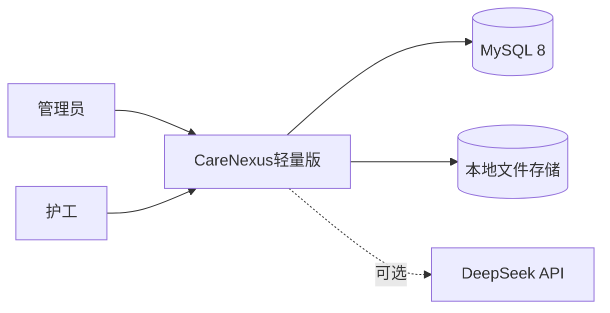

系统只围绕培训管理和学习闭环，不连接护理订单、健康监测设备或医疗信息系统。

## 2. 包图

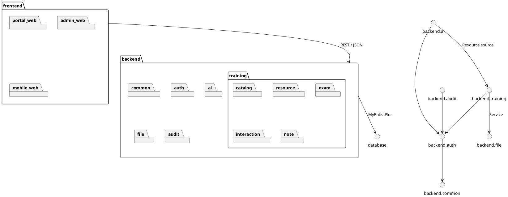

## 3. 核心领域类图

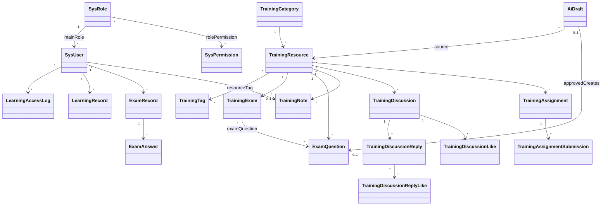

## 4. 主要实体职责

| 实体 | 职责 |
|---|---|
| `SysUser` | 账号、主角色、状态和基础资料 |
| `TrainingResource` | 课程元数据、内容、存储方式和发布状态 |
| `LearningRecord` | 用户整体培训学习汇总 |
| `LearningAccessLog` | 每次课程访问时长 |
| `TrainingExam` | 课程对应考核与通过线 |
| `ExamQuestion` | 单选题或判断题 |
| `ExamRecord` | 一次考试尝试、分数和结果 |
| `TrainingNote` | 用户与课程唯一的富文本笔记 |
| `TrainingDiscussion` | 课程讨论主题 |
| `TrainingAssignment` | 课程课后作业 |
| `AiDraft` | AI 题目草稿及审核状态 |

## 5. 登录时序

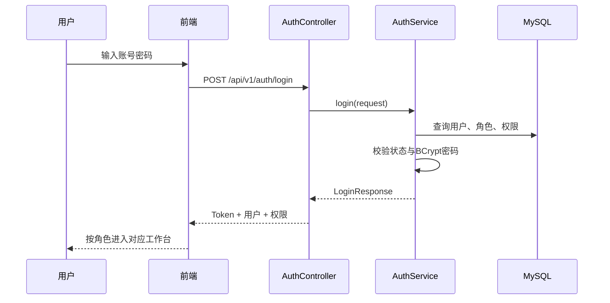

## 6. 课程发布时序

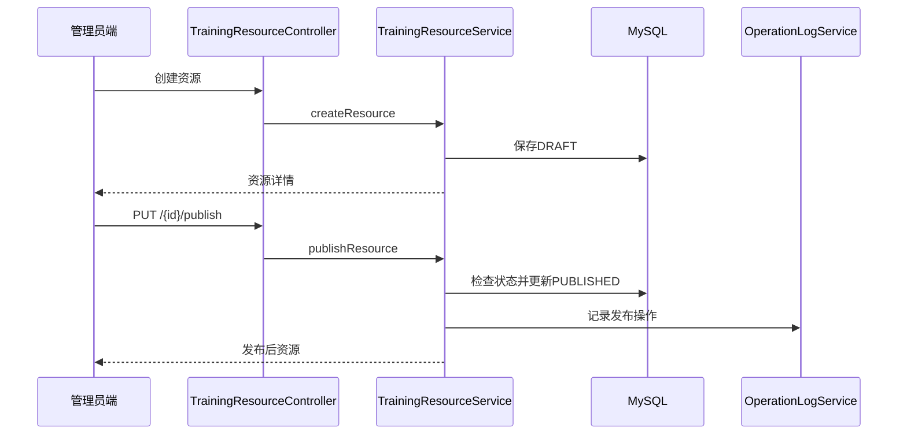

## 7. 考试提交时序

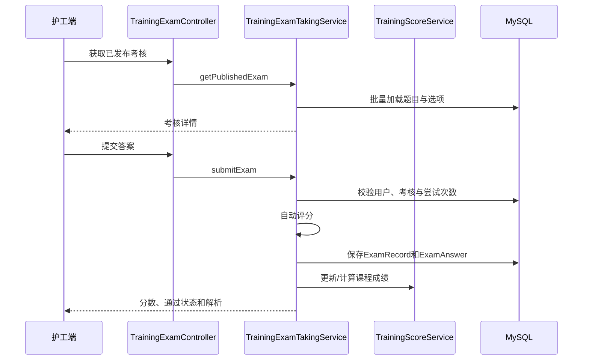

## 8. AI 草稿审核时序

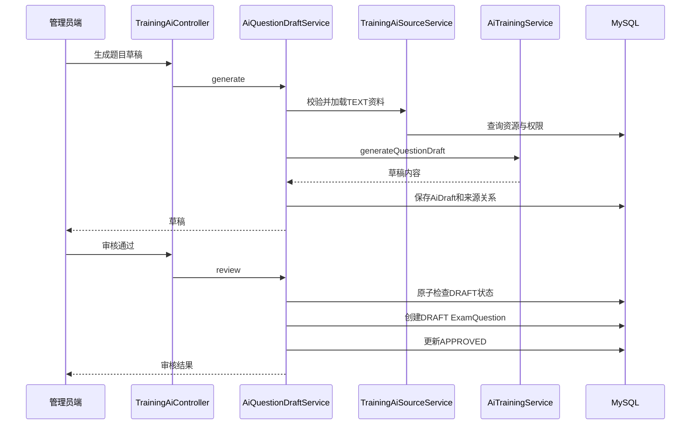

## 9. 笔记保存时序

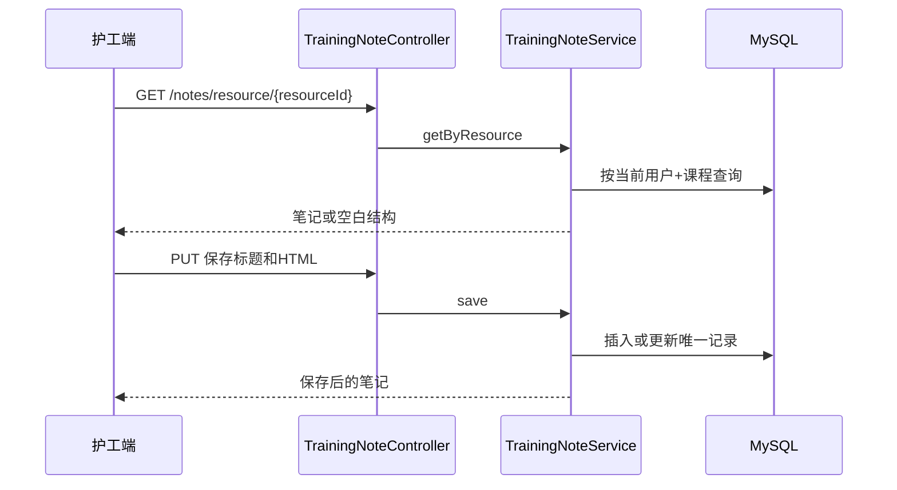

## 10. 讨论回复模型

- 主题属于课程和创建用户。
- 回复属于主题和创建用户。
- `parent_reply_id` 支持回复另一条回复。
- 主题点赞与回复点赞分别使用唯一关系表，保证同一用户只点赞一次。
- 删除操作必须校验当前用户是内容作者。

## 11. 状态模型

### 培训资源

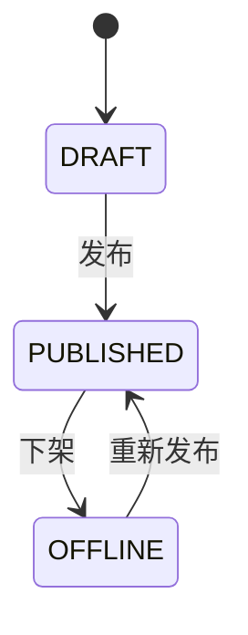

### 考核

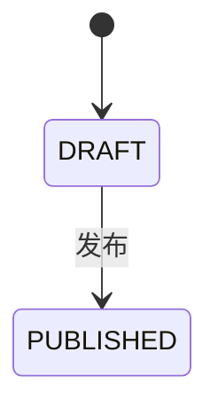

### AI 草稿

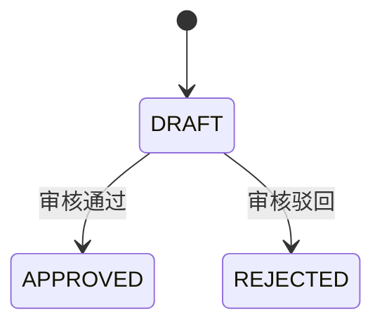

### 学习与培训

课程根据考试记录计算通过状态；整体培训根据全部已发布课程是否通过计算。前端不直接写入最终状态。

## 12. 设计约束

- 两角色边界不得被前端参数绕过。
- 模型不包含护理订单、老人家属和医生健康实体。
- AI 草稿与正式题目分离。
- 历史 36 表模型不适用于当前轻量版。
- 现行模型以 28 张表和当前 Java Entity 为准。