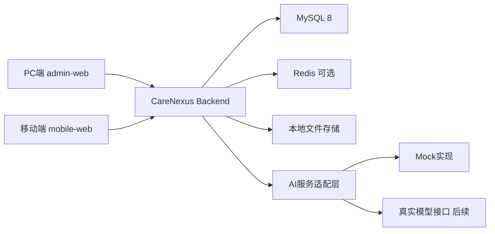
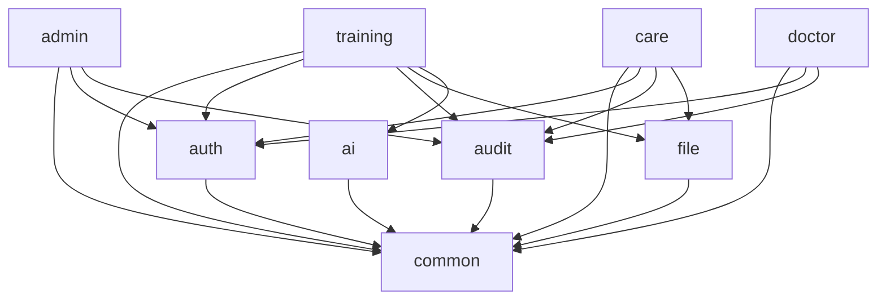

# 系统架构设计

项目名称：CareNexus 颐联

任务编号：T-011

文档状态：已审核，T-011封板

更新时间：2026-07-09

## 1. 架构目标

本文档基于 CareNexus 需求基线 v1.0，定义 MVP 阶段的总体架构、工程边界、模块职责、权限与数据隔离、AI 和文件适配方式、日志审计和部署结构。

本轮架构目标：

- 支撑护理培训系统作为最高优先级主线。
- 支撑老人/家属移动护理、护工服务执行、医生健康管理和综合管理的 MVP 闭环。
- 避免微服务化带来的部署和联调成本。
- 为后续 AI、对象存储、Docker 和更完整安全能力预留扩展点。

## 2. 架构决定

| 决策项 | 结论 |
|---|---|
| 后端技术 | Java 8、Spring Boot 2.7.x、Spring MVC、MyBatis-Plus |
| 前端技术 | Vue 3、Vite、JavaScript |
| 前端工程 | `admin-web` 和 `mobile-web` 两个工程，四个逻辑业务端通过角色、菜单和路由区分 |
| 后端组织 | 一个 Spring Boot 工程，按业务包划分模块，单体部署 |
| 登录鉴权 | Spring Security + JWT 扩展接口 + RBAC |
| 数据库 | MySQL 8.0 |
| Redis | 仅在登录状态、Token 黑名单、验证码或临时缓存确有需要时使用 |
| 文件存储 | `FileStorageService` 抽象接口，MVP 使用本地存储实现骨架 |
| AI 接入 | `AiTrainingService` 独立适配层，支持 Mock 与真实实现切换 |
| 部署 | MVP 本地单机运行为主，Docker 作为后续增强 |

## 3. 系统上下文



## 4. 前后端关系

前端采用两个工程承载四个逻辑业务端：

| 前端工程 | 承载角色 | 主要业务入口 |
|---|---|---|
| `frontend/admin-web` | 管理员、运营人员、培训管理员、医生、健康管理人员、护工 PC 学习入口 | 综合管理、护理培训管理、医生健康管理、培训学习 |
| `frontend/mobile-web` | 老人、家属、护工/护理人员 | 服务浏览、预约下单、订单评价投诉、护工订单执行、护工移动学习 |

四个业务端不按前端工程数量硬拆，而是作为权限、菜单、路由、接口和模块边界保留。

## 5. 模块化单体结构

后端使用一个部署单元：

```text
backend/
└── src/main/java/com/carenexus/
    ├── common
    ├── auth
    ├── admin
    ├── training
    ├── care
    ├── doctor
    ├── ai
    ├── file
    └── audit
```

### 5.1 模块职责

| 模块 | 职责 |
|---|---|
| `common` | 统一响应、错误码、异常处理、基础配置、健康检查 |
| `auth` | 当前用户解析、Token 扩展、RBAC 功能权限、账号状态校验 |
| `admin` | 用户、角色、权限、账号状态和基础字典 |
| `training` | 培训类别、标签、文章、视频、PPT、学习记录、考核和 AI 草稿审核 |
| `care` | 服务项目、地址、护理订单、人工分配、护工执行、评价和投诉 |
| `doctor` | 医生老人授权、健康档案、健康记录、预警、随访、干预、健康评估 |
| `ai` | 护理培训 AI 辅助适配层，隔离真实模型和 Mock 实现 |
| `file` | 文件存储抽象、本地存储实现、文件元数据扩展 |
| `audit` | 操作日志扩展接口和审计记录 |

综合管理端是前端入口，不代表 `admin` 模块拥有全部业务表。服务项目和订单归 `care` 模块，医生老人授权和健康数据归 `doctor` 模块，AI 草稿审核归 `training` 模块。

## 6. 模块依赖方向



约束：

- Controller 只负责参数接收、校验和返回。
- 事务边界放在 Service 层。
- 业务模块之间只能通过 Service 接口协作。
- 业务模块不得跨模块直接操作其他模块的数据表。
- AI 输出不得直接修改正式题库、正式考核或正式业务数据。

## 7. 登录认证与 RBAC

MVP 采用 Spring Security + JWT 扩展接口：

- 账号包含一个主要业务角色。
- 用户登录后获得访问令牌。
- RBAC 控制菜单、按钮和接口权限。
- 账号停用后不得继续登录或继续操作。
- 权限校验先做功能权限，再做数据权限。

本次工程骨架只提供扩展接口和安全配置骨架，不完整实现登录业务。

## 8. 数据权限方案

数据权限由各业务模块在 Service 层完成，`auth` 模块不得直接查询医生授权、家属绑定或护理订单表：

| 场景 | 校验规则 |
|---|---|
| 医生查看老人 | `doctor` 模块通过 `DoctorAuthorizationService.canAccessElder(currentUser, elderId)` 校验有效医生老人授权关系 |
| 家属代老人预约 | `care` 模块通过 `FamilyElderAccessService` 校验有效老人家属绑定关系 |
| 护工执行订单 | `care` 模块通过 `CareOrderAccessService` 校验订单必须分配给当前护工 |
| 管理端授权维护 | 管理员或健康管理人员具备授权维护权限 |
| AI 草稿审核 | 仅培训管理员可审核和发布草稿 |

功能权限由 `auth` 提供 RBAC 判断；领域数据权限由 `doctor`、`care`、`training` 等业务模块基于自身数据完成，避免跨模块直接访问其他模块 Mapper 或数据表。

## 9. 数据库设计原则

- 表名和字段名使用蛇形命名。
- 主键使用 `BIGINT` 自增。
- 重要业务表保留 `created_at`、`updated_at`、`created_by`、`updated_by`。
- 可逻辑删除的主数据表使用 `is_deleted`。
- 业务状态使用明确枚举值或字典值。
- 订单主状态、评价状态、投诉状态分离。
- 医生老人授权和老人家属绑定单独建模。
- 健康隐私、密码、Token 和密钥不得明文泄露。

## 10. 文件存储方案

MVP 使用本地文件存储骨架：

- 默认上传目录通过配置项指定。
- 上传文件必须校验格式、大小和安全文件名。
- 文件元数据保存到 `file_resource`。
- 对外访问路径与物理存储路径隔离。
- 后续可通过 `FileStorageService` 替换为对象存储。

文件限制初步确定：

| 类型 | 白名单 | 单文件大小 |
|---|---|---|
| 图片 | jpg、jpeg、png、webp | 10MB |
| 文档 | pdf、ppt、pptx、doc、docx | 50MB |
| 视频 | mp4、webm | 500MB |

文件名安全规则：

- 服务端生成存储文件名。
- 原始文件名仅作为展示字段保存。
- 拒绝路径穿越字符和可执行脚本类型。

## 11. Redis 使用边界

Redis 不为了展示技术栈而强行使用。允许使用场景：

- JWT 黑名单或登录状态缓存。
- 验证码或短期临时数据。
- 高频只读字典缓存。

不允许在 MVP 中把核心业务状态只存放在 Redis。

## 12. AI 服务接入边界

AI 仅用于护理培训辅助：

- 培训资料问答。
- 知识点总结。
- 学习建议。
- 基于入库资料生成题目草稿。

设计约束：

- 通过 `AiTrainingService` 访问 AI 能力。
- Mock 实现仅用于本地演示和测试隔离。
- 真实模型调用放在适配实现中。
- AI 输出必须标记为辅助内容或草稿。
- AI 不得直接写入正式题库、考核记录、医生诊断或管理决策。

## 13. 日志、异常和操作审计

- 使用统一错误码和统一响应结构。
- 全局异常处理统一转换为业务错误响应。
- 关键操作通过 `OperationLogService` 记录审计事件。
- 日志不得输出密码、Token、完整手机号、身份证号或完整健康隐私。
- 操作日志优先记录操作人、时间、类型、业务对象和结果摘要。

## 14. 测试和构建方案

| 范围 | 验证方式 |
|---|---|
| 后端 | `mvn test`、`mvn package`、健康检查接口 |
| PC前端 | `npm install`、`npm run build` |
| 移动前端 | `npm install`、`npm run build` |
| SQL | MySQL 客户端或后续迁移工具校验；当前先提供可审查 SQL 脚本 |
| 文档 | `git diff --check`、状态检查、路径检查 |

## 15. 本地运行方案

- 后端默认端口：`8080`。
- PC 端开发端口：`5173`。
- 移动端开发端口：`5174`。
- MySQL 数据库：`care_nexus`。
- 本地文件目录：`uploads/`，该目录不提交 Git。

## 16. Docker 后续规划

Docker 不作为 T-011 MVP 骨架必须运行条件。产品化阶段可补充：

- 后端镜像。
- 前端 nginx 镜像。
- MySQL 和 Redis compose 配置。
- 统一环境变量说明。

## 17. 工程目录草案

```text
backend/
frontend/
  admin-web/
  mobile-web/
database/
  init/
  dict/
docs/
```

## 18. T-010 设计依赖解决

| 依赖项 | T-011 决定 |
|---|---|
| 考核重考规则 | MVP 允许未通过后再次考试，最多 3 次；以最高分作为最终成绩，保留每次记录 |
| 健康记录必填字段 | 老人、记录时间、至少一项健康指标必填；备注可选 |
| 文件格式白名单 | 图片、文档、视频三类白名单，详见文件存储方案 |
| 文件大小限制 | 图片 10MB、文档 50MB、视频 500MB |
| 文件名安全规则 | 服务端生成存储名，原文件名仅展示，拒绝路径穿越和脚本类型 |
| 基础性能目标 | 本地演示环境记录响应时间；核心查询和提交操作目标 P95 不超过 2 秒，文件上传和 AI 调用单独记录耗时 |

## 19. 后续事项

- Java 8 + Spring Boot 2.7.x、两个前端工程承载四个逻辑业务端、当前数据库表清单、文件限制和考核重考规则已通过 T-011 复审。
- PowerDesigner 模型和截图拆分为 T-030 / Issue #2，最终交付前基于最终版 SQL 生成。
- 后续业务开发从 T-012 账号登录、当前用户和 RBAC 权限基础开始。
