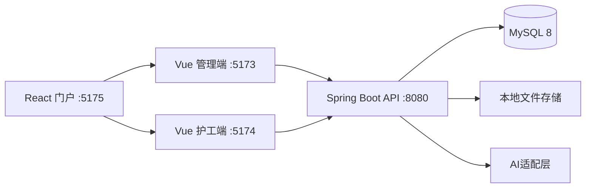

# CareNexus Lite 系统架构设计

## 架构决定

- 前后端分离、模块化单体、一个 Spring Boot 部署单元。
- 三个前端：React 门户、Vue 管理员端、Vue 护工端。
- MySQL 8 为唯一业务数据源；当前不依赖 Redis。
- JWT + RBAC；数据权限在培训业务 Service 中完成。
- 文件存储由接口隔离，Lite 使用本地目录。
- AI 由 `AiTrainingService` 适配，默认 Mock，可切换 DeepSeek。

## 后端模块

| 模块 | 职责 |
| --- | --- |
| `common` | 响应、异常、安全入口、CORS、健康检查 |
| `auth` | 登录、JWT、当前用户、RBAC、账号状态 |
| `training` | 分类、标签、资源、学习、笔记、讨论、作业、题库、考试、成绩 |
| `ai` | 资料读取、问答/总结/建议、题目草稿与审核 |
| `file` | 文件校验、存储和资源登记 |
| `audit` | 关键操作日志 |

依赖方向：前端 -> Controller -> Service -> Mapper -> MySQL。业务模块不得跨模块直接访问 Mapper。

## 安全设计

- 匿名接口仅包括健康检查和登录。
- 其余 API 默认认证，方法级权限控制管理员/护工能力。
- 401和403返回统一JSON；业务异常映射400/404/409；系统异常记录日志并返回500。
- 密码使用 BCrypt，JWT密钥、数据库密码和模型密钥由环境变量注入。

## 部署

当前验收使用本机单机部署：三个 Vite 服务 + Spring Boot + MySQL。生产化可将前端构建产物交由 Nginx 托管，并把后端和 MySQL 容器化，但不属于当前交付必需项。
