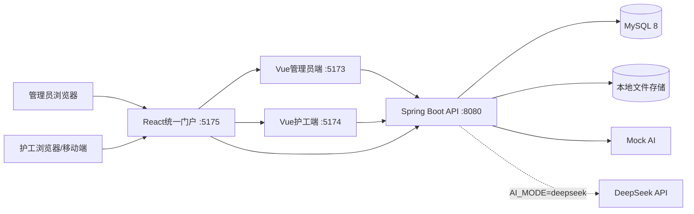
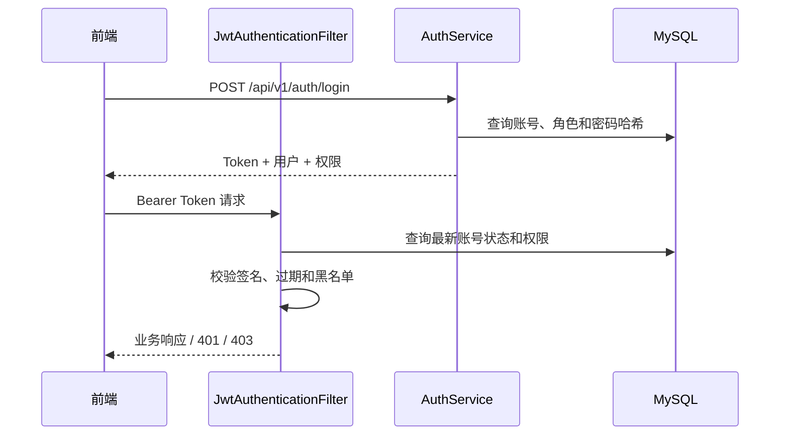
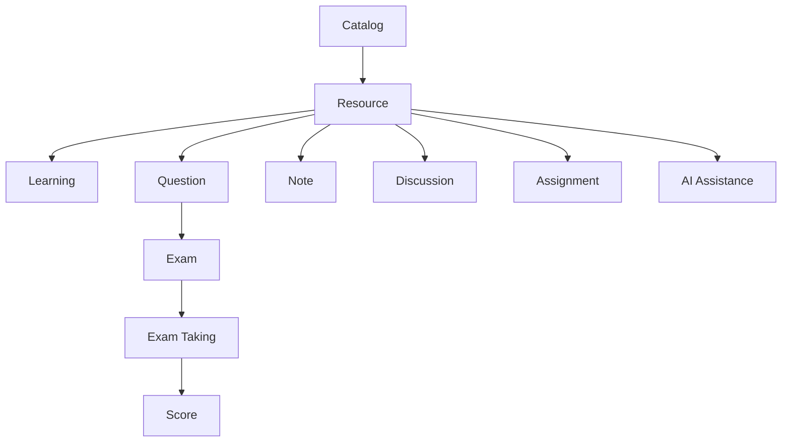
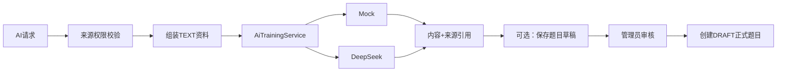

# 系统架构设计

项目名称：CareNexus 颐联  
版本：轻量版 2.0  
更新时间：2026-07-15

## 1. 架构目标

CareNexus 轻量版采用前后端分离的模块化单体架构，目标是以较低部署复杂度完成管理员培训管理、护工学习考核和 AI 辅助学习闭环。

设计原则：

- 只保留管理员与护工两角色。
- 业务围绕培训资源、学习、考核、互动和 AI 展开。
- 后端模块边界清晰，避免跨模块直接访问 Mapper。
- 默认 Mock AI 保证离线开发和测试稳定。
- 使用 MySQL 顺序脚本维护可追踪的数据结构。
- 不承担医疗诊断或健康管理职责。

## 2. 总体架构



## 3. 分层结构

### 展示层

- `frontend/portal-web`：品牌门户、角色入口、课程工作区和富文本组件。
- `frontend/admin-web`：管理员工作台。
- `frontend/mobile-web`：护工学习端。

### 接口层

Spring MVC Controller 负责：

- 路由和 HTTP 方法。
- 请求参数校验。
- 调用 Service。
- 统一返回 `ApiResponse` 或 `PageResponse`。

Controller 不直接实现复杂业务，不直接访问 Mapper。

### 业务层

| 模块 | 主要职责 |
|---|---|
| `auth` | 登录、JWT、当前用户、账号状态、权限加载 |
| `training.catalog` | 分类与标签 |
| `training.resource` | 培训资源写入、查询、标签和访问策略 |
| `training.exam` | 题库、考核、学习记录、考试提交、成绩和错题 |
| `training.service` | 笔记、课程讨论和课后作业 |
| `ai` | AI 来源校验、问答、总结、建议、草稿和审核 |
| `file` | 文件资源与本地存储 |
| `audit` | 操作日志 |
| `common` | 响应、异常、安全和基础配置 |

### 持久层

MyBatis-Plus Entity 与 Mapper 负责数据库访问。跨模块协作通过 Service 接口完成，例如 training 模块通过 `FileResourceService` 获取文件资源，而不是直接引用 file 模块 Mapper。

## 4. 认证与权限架构



- Token 只保存身份声明，不把权限永久冻结在 Token 中。
- 权限变更或账号停用后，后续请求读取最新状态。
- 前端路由守卫只是体验控制，后端权限校验是最终边界。

## 5. 培训领域架构

培训领域按职责拆分：



关键约束：

- 一门课程对应一份考核。
- 题目与课程绑定，再通过关联表进入考核。
- 学习、考试、笔记、讨论和作业均围绕课程资源组织。
- 成绩由考试记录计算，不在前端伪造。

## 6. AI 架构

`AiTrainingService` 是模型适配接口：

- `MockAiTrainingService`：默认实现，稳定、可预测，供测试和无网络环境使用。
- `DeepSeekAiTrainingService`：`AI_MODE=deepseek` 时启用。
- `TrainingAiSourceService`：加载并校验可访问的文本培训资料。
- `TrainingAiAssistanceService`：问答、总结和建议。
- `AiQuestionDraftService`：草稿生成、分页、详情和审核。



AI 不直接操作考试发布，不读取健康数据，也不绕过管理员审核。

## 7. 数据架构

数据库最终 28 张表，分为：

- 账号与权限：`sys_role`、`sys_permission`、`sys_user`、`sys_role_permission`、`sys_dict`。
- 审计与文件：`operation_log`、`file_resource`。
- 资源与学习：分类、标签、资源、资源标签、学习记录、访问日志、笔记。
- 题库与考核：考核、题目、选项、考核题目、考试记录、答案。
- AI：草稿与来源关系。
- 互动与作业：讨论、回复、点赞、作业和提交。

详细结构见 `数据库设计.md` 和 `database/dict/data-dictionary.md`。

## 8. 文件存储

当前使用本地文件系统：

- 根目录由 `FILE_STORAGE_ROOT` 配置。
- 文件名使用安全存储名，避免直接使用用户原始路径。
- 按图片、文档和视频分别限制大小。
- 校验扩展名和 MIME。
- 静态访问只暴露必要的相对 URL。

对象存储不是当前必需依赖，后续可通过实现 `FileStorageService` 扩展。

## 9. 前端架构

### 统一门户

React + TypeScript，负责品牌展示、角色入口和部分课程工作区。富文本编辑使用 Tiptap，动画使用 GSAP。

### 管理员端

Vue 3：

- 培训资源。
- 分类与标签。
- 题库与考核。
- AI 草稿审核。
- 培训成绩。

### 护工端

Vue 3：

- 登录与会话。
- 课程列表和详情。
- 学习进度、成绩和错题。
- 课程笔记。
- 讨论、作业和个人账号。

## 10. 部署视图

当前本地开发部署：

```text
Browser
  ├─ portal-web  :5175
  ├─ admin-web   :5173
  └─ mobile-web  :5174
          │
          ▼
Spring Boot API  :8080
  ├─ MySQL 8     :3306
  ├─ uploads/
  └─ DeepSeek API（可选）
```

尚未提供正式 Docker/nginx 配置。生产部署必须外置数据库密码、JWT Secret 和 AI Key，并配置 HTTPS、反向代理和持久化文件目录。

## 11. 质量属性

- 安全：BCrypt、JWT、动态权限、上传校验、统一 401/403。
- 可测试：Mock AI、MockMvc、JUnit 5、Checkstyle。
- 可维护：模块化 Service、统一 DTO/VO、顺序迁移脚本。
- 可扩展：AI 和文件存储使用接口适配。
- 可追踪：操作日志、Changelog、Test Log 和任务记录。

## 12. 架构限制

- 当前是模块化单体，不拆微服务。
- 当前不强制 Redis、消息队列或对象存储。
- 当前不包含医生、老人、家属和护理订单模块。
- 当前 AI 不是医疗 AI。
- 当前数据库结构以 28 张表和 001–008 脚本为准。