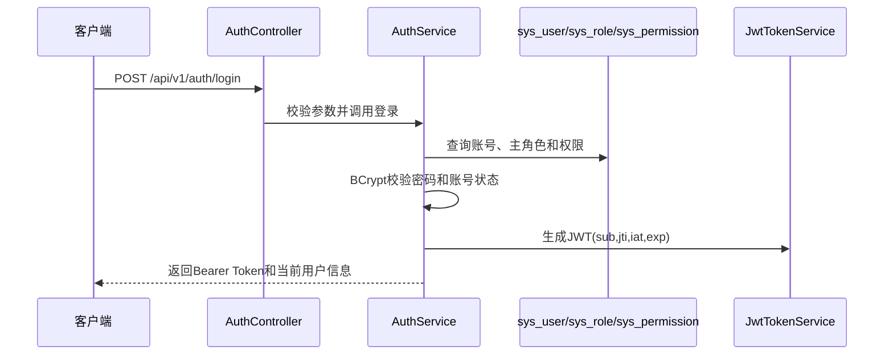
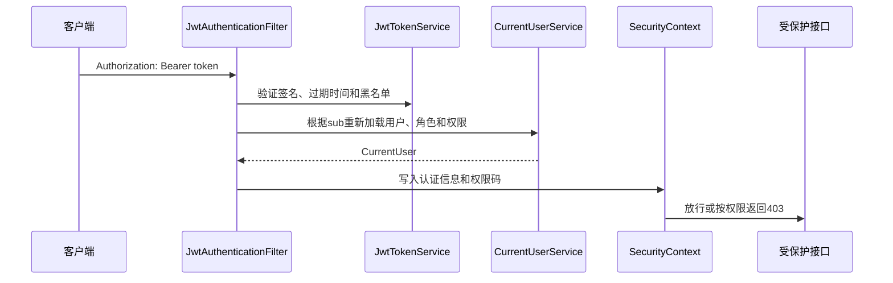

# 认证与 RBAC 基础设计说明

任务编号：T-012

文档状态：初稿，待项目负责人审核

更新时间：2026-07-09

## 1. 设计目标

T-012 实现后端账号密码登录、当前用户查询、退出登录、JWT 认证过滤器、账号状态校验和 RBAC 功能权限加载基础。

本任务只处理后端认证和功能权限，不处理前端登录页、菜单权限、医生老人授权、家属老人绑定和护工订单数据权限。

## 2. 认证流程



## 3. 请求认证流程



## 4. JWT字段

| 字段 | 含义 |
|---|---|
| `sub` | 用户ID |
| `jti` | Token唯一标识 |
| `iat` | 签发时间 |
| `exp` | 过期时间 |

JWT 不保存密码、密码哈希、手机号、身份证号、健康记录、服务地址和其他敏感隐私数据。

## 5. Token配置

| 配置项 | 说明 |
|---|---|
| `CARE_NEXUS_JWT_SECRET` | JWT签名密钥，生产环境必须通过环境变量或外部配置注入 |
| `CARE_NEXUS_JWT_EXPIRATION_SECONDS` | Token有效期秒数 |

仓库中的 `application.yml` 仅保留本地开发示例值，不提交真实生产密钥。

## 6. 退出登录

MVP 使用单机内存 JWT 黑名单：

- 使用 `jti` 作为黑名单标识。
- 黑名单记录保存到 Token 过期时间。
- 使用线程安全集合维护。
- Token 认证时检查 `jti` 是否已进入黑名单。
- 重复调用 logout 不应产生 500。

限制：

- 应用重启后黑名单丢失。
- 已退出但尚未过期的旧 JWT 在应用重启后可能重新有效。
- 当前仅用于本地单机 MVP 演示。
- 后续可替换为 Redis 黑名单。

## 7. RBAC加载规则

```text
sys_user.main_role_id -> sys_role -> sys_role_permission -> sys_permission.permission_code
```

- MVP 阶段一个账号只有一个主要业务角色。
- 权限判断使用 `permission_code`。
- 不使用中文角色名或中文权限名进行代码判断。
- 领域数据权限由 `doctor`、`care` 等业务模块 Service 自行校验，`auth` 不跨模块查询业务表。

## 8. 本轮接口

| 接口 | 说明 |
|---|---|
| `POST /api/v1/auth/login` | 账号密码登录 |
| `GET /api/v1/auth/me` | 查询当前登录用户 |
| `POST /api/v1/auth/logout` | 退出登录并将当前 Token 加入黑名单 |
| `GET /api/v1/auth/rbac-check` | T-012 后端权限验证接口，需要 `system:user:view` 权限 |

## 9. 演示账号

演示账号统一密码为 `Demo@123456`，数据库仅保存 BCrypt 哈希，不保存明文密码。

| 账号 | 角色 |
|---|---|
| `admin_demo` | 管理员 |
| `operator_demo` | 运营人员 |
| `trainer_demo` | 培训管理员 |
| `caregiver_demo` | 护工/护理人员 |
| `elder_demo` | 老人 |
| `family_demo` | 家属 |
| `doctor_demo` | 医生 |
| `health_manager_demo` | 健康管理人员 |
| `disabled_demo` | 停用账号测试数据 |
| `deleted_demo` | 逻辑删除账号测试数据 |

## 10. 后续任务边界

- T-013 负责前端登录与权限接入。
- 用户、角色、权限完整 CRUD 放入后续综合管理模块任务。
- Redis 黑名单、刷新 Token、多设备登录和账号锁定属于后续增强项。
