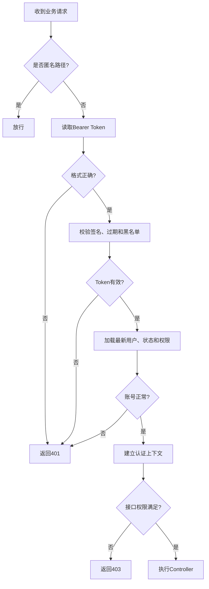

# 认证与 RBAC 设计说明

项目名称：CareNexus 颐联  
版本：轻量版 2.0  
更新时间：2026-07-15

## 1. 目标

认证模块为统一门户、管理员端和护工端提供一致的登录、会话、账号状态和权限控制。轻量版只保留 `ADMIN` 与 `CAREGIVER` 两类角色。

## 2. 相关接口

| 方法 | 路径 | 说明 |
|---|---|---|
| POST | `/api/v1/auth/login` | 用户名密码登录 |
| GET | `/api/v1/auth/me` | 获取当前用户、主角色和权限 |
| POST | `/api/v1/auth/logout` | 当前 Token 退出并加入黑名单 |
| GET | `/api/v1/auth/rbac-check` | 最小权限验证接口 |

健康检查和登录匿名开放，其他业务接口默认需要认证。

## 3. 登录流程

1. 前端提交用户名和密码。
2. `AuthServiceImpl` 查询账号、主角色和权限。
3. 校验账号不存在、逻辑删除或停用状态。
4. 使用 BCrypt 校验密码。
5. 生成 JWT Bearer Token。
6. 返回用户资料、角色代码和权限码。
7. 前端保存会话并按角色进入对应工作台。

错误密码和不存在账号使用相同对外提示，避免账号枚举。

## 4. Token 设计

- 使用 JJWT 0.11.5。
- 默认有效期 7200 秒，可通过 `CARE_NEXUS_JWT_EXPIRATION_SECONDS` 配置。
- Secret 通过 `CARE_NEXUS_JWT_SECRET` 配置。
- Token 通过 `Authorization: Bearer <token>` 传递。
- 退出后 Token 进入单机内存黑名单。
- Token 只承担身份认证，不把权限永久固定在签发时。

当前黑名单为单机内存实现，服务重启后清空；正式多实例部署需要替换为共享存储方案。

## 5. 请求认证流程



## 6. RBAC 模型

数据库关系：

```text
sys_user.main_role_id -> sys_role.id
sys_role -> sys_role_permission -> sys_permission
```

当前权限码：

| 权限码 | 用途 |
|---|---|
| `system:user:view` | 用户查看与 RBAC 验证 |
| `system:role:view` | 角色查看 |
| `system:user:manage` | 用户管理基础权限 |
| `training:resource:view` | 培训内容、学习和个人培训能力 |
| `training:resource:manage` | 培训资源、题库考核、AI 草稿和成绩管理 |

管理员拥有全部种子权限；护工拥有 `training:resource:view`。

业务接口仍应在 Service 层校验数据范围，例如个人笔记、成绩和作业不能只依赖通用权限码。

## 7. 后端安全组件

| 组件 | 职责 |
|---|---|
| `SecurityConfig` | 路径规则、过滤器、CORS、异常处理和方法安全 |
| `JwtAuthenticationFilter` | 解析 Token、校验状态并建立认证上下文 |
| `JwtTokenService` | Token 生成、解析和校验 |
| `TokenBlacklist` | 退出 Token 失效 |
| `AuthUserService` | 加载用户、角色和最新权限 |
| `PermissionService` | 方法级权限判断 |
| `JsonAuthenticationEntryPoint` | 统一 401 JSON |
| `JsonAccessDeniedHandler` | 统一 403 JSON |

## 8. 前端会话

### 管理员端

- 会话模块保存 Token 和当前用户。
- 请求封装自动添加 Bearer Token。
- 路由守卫校验认证和权限。
- 401 时清理会话并返回统一门户。

### 护工端

- 登录页处理会话建立和恢复。
- 受保护路由要求 `CAREGIVER` 和对应权限。
- Token 失效时跳转登录并保留目标地址。

### 统一门户

承担角色入口和跨应用跳转。三个前端对 Token 存储和过期清理策略应保持兼容。

## 9. CORS

默认允许本地前端：

- `http://localhost:5173`
- `http://127.0.0.1:5173`
- `http://localhost:5174`
- `http://127.0.0.1:5174`

门户端口 5175 如直接请求后端，部署或本地联调时应同步加入允许来源或通过 Vite 代理访问。

## 10. 错误语义

| 场景 | HTTP |
|---|---:|
| 未登录、Token 缺失或无效 | 401 |
| 账号停用、删除、Token 过期或退出后复用 | 401 |
| 已认证但缺少权限 | 403 |
| 业务资源不存在或不可见 | 404 |
| 状态冲突、重复审核或重复发布 | 409 |
| 参数校验失败 | 400 |

所有错误使用统一 JSON 响应，不返回 HTML 登录页或服务器堆栈。

## 11. 安全限制

- 演示密码只用于本地开发，生产环境必须删除演示账号。
- README 和脚本中的默认 JWT Secret 不可用于生产。
- 数据库密码、Token、AI Key 和完整敏感信息不得写入日志。
- 前端菜单隐藏不能代替后端权限校验。
- 不允许通过请求体传入其他用户 ID 访问个人数据。

## 12. 测试重点

- 登录成功和错误密码。
- 不存在、停用、逻辑删除账号。
- 缺失、伪造、签名错误、过期和黑名单 Token。
- 退出后旧 Token 返回 401。
- 管理权限 200、护工管理操作 403。
- 账号停用后已签发 Token 失效。
- 权限调整后旧 Token 使用最新权限。
- 三个前端的会话恢复、401 清理和路由守卫。

## 13. 后续增强

- 多实例部署时使用 Redis 等共享黑名单。
- 增加刷新 Token 或更短期访问 Token。
- 管理员账号增加更强密码策略和操作审计。
- 正式部署启用 HTTPS、Secure/HttpOnly Cookie 或经安全评估的 Token 存储方案。