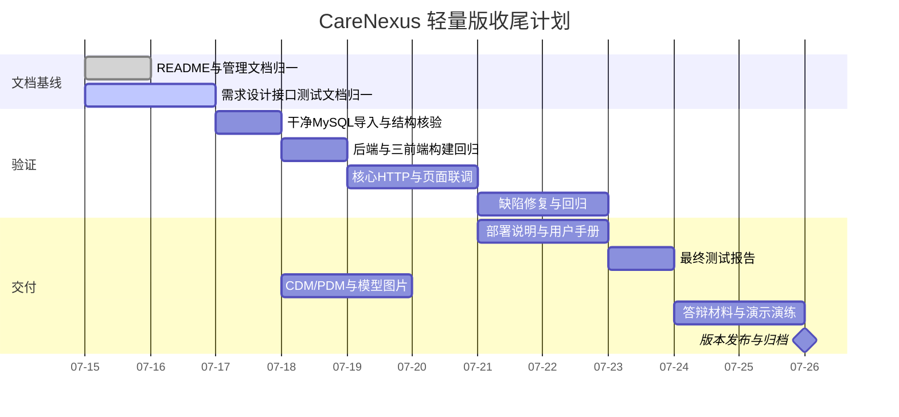
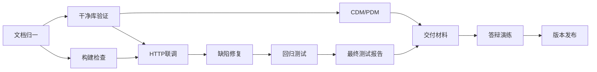

# 项目进度计划

项目名称：CareNexus 颐联  
版本：轻量版 2.0  
更新时间：2026-07-15

## 1. 计划说明

早期计划以完整版多角色系统和课程短周期为基础，已经不适合当前 `lite_develop`。本计划从当前实际状态出发，只安排轻量版收尾、验证和交付工作。

## 2. 当前进度

| 工作项 | 状态 |
|---|---|
| 轻量版范围收敛 | 已完成 |
| 认证与权限 | 已完成 |
| 培训资源 | 已完成 |
| 学习、题库、逐课考核和成绩 | 已完成 |
| AI 培训辅助 | 已完成主要实现 |
| 富文本笔记 | 已完成主要实现 |
| 讨论、点赞和课后作业 | 已完成主要实现 |
| 三个前端主要页面 | 已形成 |
| 本地启动与演示数据 | 已形成 |
| 现行文档归一 | 进行中 |
| 干净库和全链路回归 | 待执行 |
| 部署手册、用户手册和最终报告 | 待执行 |
| CDM/PDM | 待执行 |
| 答辩与发布 | 待执行 |

## 3. 收尾阶段安排

日期为当前收尾建议，可根据实训截止时间压缩，但任务依赖不应打乱：数据库和构建验证先于最终报告与发布。

## 4. 任务依赖

## 5. 每阶段交付物

### 文档归一

- README、AGENTS。
- 范围、状态、任务和负责人。
- 需求、用例、流程。
- 架构、模型、原型、数据库和认证。
- API 规范和接口清单。
- 测试计划与用例。
- 数据库目录与模型说明。

### 数据库与构建

- MySQL 版本和执行命令。
- 001–008 导入结果。
- 28 表和约束核验。
- `mvn verify` 结果。
- 三个前端 lint/build 结果。

### 联调与回归

- 管理员主线。
- 护工主线。
- 权限矩阵。
- 文件上传。
- Mock 与可选 DeepSeek。
- 缺陷列表和关闭证据。

### 交付

- 部署说明。
- 管理员与护工用户手册。
- 最终测试报告。
- CDM/PDM 与图片。
- 答辩 PPT、项目总结、演示数据说明。
- 版本发布记录和交付清单。

## 6. 负责人安排

| 工作 | 主负责人 | 配合 |
|---|---|---|
| 文档归一与后端核对 | 隋咏轩 | 李亦航、张远航 |
| 前端构建与页面联调 | 孙洋 | 隋咏轩 |
| 数据库验证与模型 | 隋咏轩 | 张远航 |
| 测试执行和缺陷记录 | 张远航 | 全体 |
| 部署与用户手册 | 李亦航 | 孙洋、隋咏轩 |
| 答辩与发布 | 全体 | 全体 |

## 7. 里程碑检查表

### M1 文档基线

- [ ] 所有现行文档不再把订单、医生模块写为当前功能。
- [ ] 表数量统一为 28。
- [ ] AI 状态统一为 Mock/DeepSeek 已实现。
- [ ] 页面和接口与当前代码一致。

### M2 可重复环境

- [ ] 新 MySQL 8 库导入成功。
- [ ] 四个服务可启动。
- [ ] 演示账号和课程可用。
- [ ] 中文数据无乱码。

### M3 核心回归

- [ ] 后端 verify 通过。
- [ ] 三个前端构建通过。
- [ ] 管理员主线通过。
- [ ] 护工主线通过。
- [ ] 权限矩阵通过。

### M4 交付完成

- [ ] P0/P1 为 0。
- [ ] 用户手册、部署说明、测试报告完成。
- [ ] CDM/PDM 完成。
- [ ] 答辩演练完成。

### M5 发布

- [ ] 固定提交 SHA。
- [ ] 创建 `lite-v1.0.0` 标签。
- [ ] 发布说明列出功能、限制和已知问题。
- [ ] 交付包归档。

## 8. 进度风险

- 文档数量多：优先现行基线，不回写历史日志。
- 环境不稳定：使用隔离 MySQL 8 和依赖缓存。
- 截止时间压缩：先保证认证、课程、考核、成绩和演示主线；不恢复完整版模块。
- AI 外部服务不可用：用 Mock 完成必选验收，DeepSeek 作为增强。
- 模型制作较晚：先冻结 28 表 SQL，再制作 CDM/PDM，避免返工。

## 9. 状态更新规则

每完成一阶段：

1. 更新 `TASKS.md` 和 `PROJECT_STATUS.md`。
2. 将实际测试结果追加到 `TEST_LOG.md`。
3. 将重要变化追加到 `CHANGELOG.md`。
4. 关联提交或 PR。
5. 未验证事项保持 TODO/REVIEW，不提前标记 DONE。