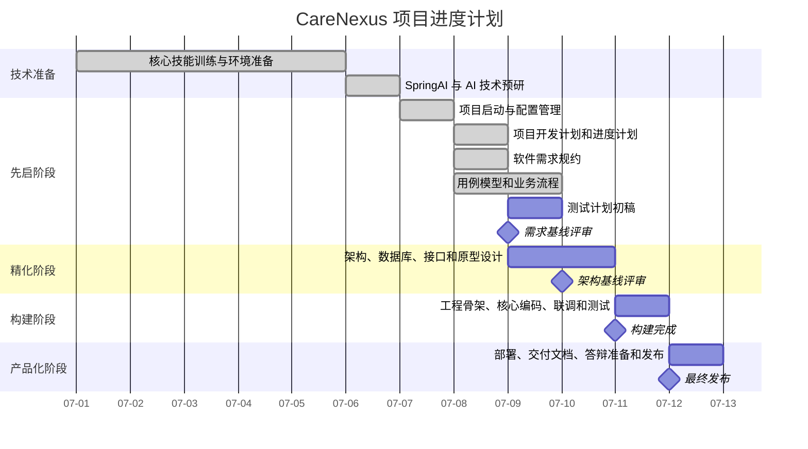

# 项目进度计划

## 1. 进度计划说明

本文档用于记录 CareNexus 颐联项目的阶段进度、每日任务、任务依赖、里程碑和交付物检查安排。

本进度计划采用“阶段 + 课程天数 + 项目任务 + 负责人 + 交付物 + 依赖 + 状态”的粒度，便于后续转换为甘特图和阶段检查表。

当前项目处于先启阶段，尚未进入需求基线、架构设计、数据库设计和业务编码阶段。

## 2. 双时间轴说明

| 时间轴 | 范围 | 说明 |
|---|---|---|
| 课程完整周期 | 第1天至第12天 | 包含技能训练、AI工具、SpringAI、软件工程过程和项目实践 |
| 正式项目实施期 | 第7天至第12天 | 按 RUP 四阶段组织项目计划、需求、设计、构建、测试和交付 |

课程第 1-6 天作为技术准备和选题预研期。正式项目计划从第 7 天开始计算。

## 3. RUP 阶段进度安排

| 阶段 | 课程时间 | 重点目标 | 阶段状态 |
|---|---|---|---|
| 先启阶段 | 第7天至第9天上午 | 项目计划、配置管理、需求规约、用例模型、测试计划、需求基线 | 进行中 |
| 精化阶段 | 第9天下午至第10天 | 架构设计、数据库设计、接口设计、原型设计、详细测试用例、架构基线 | 未开始 |
| 构建阶段 | 第11天 | 工程骨架、核心编码、联调、单元测试、缺陷修复 | 未开始 |
| 产品化阶段 | 第12天 | 部署、演示数据、最终测试报告、用户手册、答辩材料、发布 | 未开始 |

## 4. 每日任务进度表

| 课程天数 | 阶段 | 主要任务 | 负责人 | 交付物 | 依赖 | 状态 |
|---|---|---|---|---|---|---|
| 第1-5天 | 技术准备 | Java、MyBatisPlus、SpringBoot、Vue、AI工具等课程训练 | 全体成员 | 课程练习、技术准备记录 | 无 | 已发生 |
| 第6天 | 技术准备 | SpringAI 和 SpringBoot 集成训练，AI 能力预研 | 隋咏轩、孙洋 | AI 技术预研记录 | 课程安排 | 已发生 |
| 第7天上午 | 先启阶段 | 学习 RUP、CMMI3 和软件项目计划要求 | 全体成员 | 过程规范理解记录 | 实习要求 | 已发生 |
| 第7天下午 | 先启阶段 | 团队组建、仓库初始化、配置管理计划 | 隋咏轩 | README、AGENTS、配置管理计划 | GitHub 仓库 | 已完成 |
| 第8天上午 | 先启阶段 | 编写项目开发计划和项目进度计划 | 李亦航，隋咏轩审核 | `docs/plans/项目开发计划.md`、`docs/plans/项目进度计划.md` | T-003、T-004 | DONE |
| 第8天下午 | 先启阶段 | 软件需求规约初稿、用例模型和业务流程初稿 | 李亦航 | `docs/requirements/软件需求规约.md`、`docs/requirements/用例模型.md`、`docs/requirements/业务流程.md` | T-005 | DONE |
| 第9天上午 | 先启阶段 | 测试计划初稿、需求评审、需求基线确认 | 张远航，隋咏轩组织 | `docs/test/测试计划.md`、需求基线记录 | T-006、T-007、T-008 | TODO |
| 第9天下午 | 精化阶段 | 架构设计、模块划分、接口设计初稿 | 隋咏轩、孙洋 | 架构设计说明、接口设计说明 | T-009 | TODO |
| 第10天上午 | 精化阶段 | 数据库设计、CDM/PDM、详细测试用例 | 隋咏轩、张远航 | 数据库设计说明、测试用例 | T-009 | TODO |
| 第10天下午 | 精化阶段 | 原型设计、概要/详细设计、架构基线评审 | 隋咏轩、孙洋 | 设计说明书、架构基线记录 | 架构和数据库设计 | TODO |
| 第11天上午 | 构建阶段 | 创建工程骨架、统一登录与权限基础 | 隋咏轩、孙洋 | 后端/前端/数据库工程骨架 | 架构基线 | TODO |
| 第11天下午 | 构建阶段 | 护理培训核心功能、三端 MVP 闭环、联调和缺陷修复 | 隋咏轩、孙洋，张远航测试 | 源码、可执行代码、测试日志、缺陷记录 | 工程骨架 | TODO |
| 第12天上午 | 产品化阶段 | 部署说明、用户手册、产品说明、最终测试报告 | 张远航，隋咏轩审核 | 交付文档、测试报告 | 构建完成 | TODO |
| 第12天下午 | 产品化阶段 | 演示准备、答辩材料、项目总结、最终发布 | 全体成员 | 答辩 PPT、交付清单、`v1.0.0` | 最终评审 | TODO |

## 5. 任务依赖关系表

| 任务编号 | 任务名称 | 前置依赖 | 后续任务 |
|---|---|---|---|
| T-003 | 确认团队分工和模块负责人 | T-001、T-002 | T-005 |
| T-004 | 编写配置管理计划 | T-001、T-002 | T-005、T-009 |
| T-005 | 编写项目开发计划和进度计划 | T-003、T-004 | T-006、T-007、T-008 |
| T-006 | 编写软件需求规约初稿 | T-005 | T-009 |
| T-007 | 建立用例模型和业务流程初稿 | T-005、T-006 | T-009 |
| T-008 | 编写测试计划初稿 | T-005、T-006 | T-009 |
| T-009 | 确认需求基线 | T-006、T-007、T-008 | T-010、T-011、创建 `develop` |
| T-010 | 详细测试用例设计 | T-009 | 构建阶段测试 |
| T-011 | 架构、数据库设计和工程骨架准备 | T-009 | 后续业务编码任务 |

## 6. 里程碑表

| 里程碑 | 计划时间 | 主要输入 | 输出结果 | 判定标准 |
|---|---|---|---|---|
| 项目启动 | 第7天 | 选题、仓库、团队成员 | 仓库初始化、过程规范 | README、AGENTS、基础 docs 存在 |
| 配置管理完成 | 第7天 | 配置管理需求 | 配置管理计划 | T-004 DONE |
| 项目计划完成 | 第8天上午 | T-003、T-004、项目计划书、实习要求 | 项目开发计划、项目进度计划 | T-005 DONE，已由项目负责人审核 |
| 需求基线 | 第9天上午 | 需求规约、用例模型、测试计划初稿 | 需求基线记录 | T-009 DONE，允许创建 `develop` |
| 架构基线 | 第10天 | 需求基线、架构设计、数据库设计、接口设计 | 架构基线记录 | 架构和数据库设计评审通过 |
| 构建完成 | 第11天 | 架构基线、工程骨架、核心任务 | 可运行 MVP、测试日志、缺陷记录 | 核心流程可演示，无阻塞缺陷 |
| 最终发布 | 第12天 | 构建结果、测试报告、交付文档 | `v1.0.0`、交付清单、答辩材料 | 项目展示与评审通过 |

## 7. 交付物检查表

| 阶段 | 交付物 | 存放位置 | 当前状态 |
|---|---|---|---|
| 先启阶段 | 配置管理计划 | `docs/plans/配置管理计划.md` | DONE |
| 先启阶段 | 项目开发计划 | `docs/plans/项目开发计划.md` | DONE |
| 先启阶段 | 项目进度计划 | `docs/plans/项目进度计划.md` | DONE |
| 先启阶段 | 软件需求规约 | `docs/requirements/软件需求规约.md` | DONE |
| 先启阶段 | 用例模型和业务流程 | `docs/requirements/用例模型.md`、`docs/requirements/业务流程.md` | DONE |
| 先启阶段 | 测试计划初稿 | `docs/test/测试计划.md` | TODO |
| 先启阶段 | 需求基线记录 | `docs/management/` | TODO |
| 精化阶段 | 系统架构设计说明书 | `docs/design/` | TODO |
| 精化阶段 | 数据库设计说明书 | `docs/design/` | TODO |
| 精化阶段 | 接口设计说明 | `docs/api/` | TODO |
| 精化阶段 | 测试用例 | `docs/test/` | TODO |
| 构建阶段 | 源代码和可执行代码 | 后续确认的工程目录 | TODO |
| 构建阶段 | 单元测试日志和缺陷记录 | `docs/test/`、`docs/management/issues/` | TODO |
| 产品化阶段 | 最终测试报告 | `docs/test/` | TODO |
| 产品化阶段 | 部署说明、用户手册、产品说明、交付清单 | `docs/delivery/` | TODO |
| 产品化阶段 | 答辩材料和项目总结 | `docs/delivery/` | TODO |

## 8. Mermaid Gantt 进度图

下图暂按课程第 1 天为 2026-07-01 绘制，若实际课程起始日期不同，所有日期按实际起始日期整体平移，阶段顺序和相对天数不变。

## 9. 当前限制

- 不创建 `develop` 分支，直到 T-009 需求基线确认。
- 不创建前端、后端或数据库工程，直到 T-011 启动并获得授权。
- 不实现业务代码。
- 不将未执行的软件测试写成“通过”。
- 不扩大 AI 模块范围；AI 仅在护理培训系统 MVP 中作为培训辅助能力。
