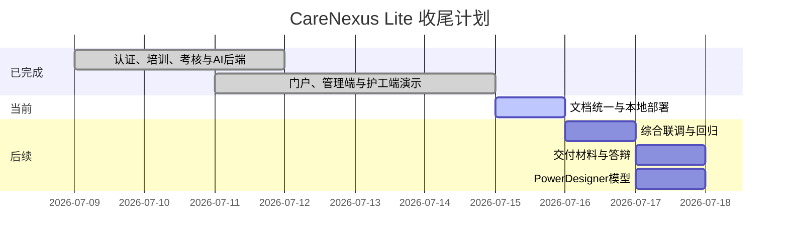

# CareNexus Lite 项目进度计划

```mermaid
gantt
  title CareNexus Lite 收尾计划
  dateFormat YYYY-MM-DD
  section 已完成
  认证、培训、考核与AI后端 :done, a1, 2026-07-09, 3d
  门户、管理端与护工端演示 :done, a2, 2026-07-11, 4d
  section 当前
  文档统一与本地部署 :active, a3, 2026-07-15, 1d
  section 后续
  综合联调与回归 :a4, after a3, 1d
  交付材料与答辩 :a5, after a4, 1d
  PowerDesigner模型 :a6, after a4, 1d
```

任务完成状态以 `docs/management/TASKS.md` 为准。未执行的软件测试和交付任务不得提前写成完成。
