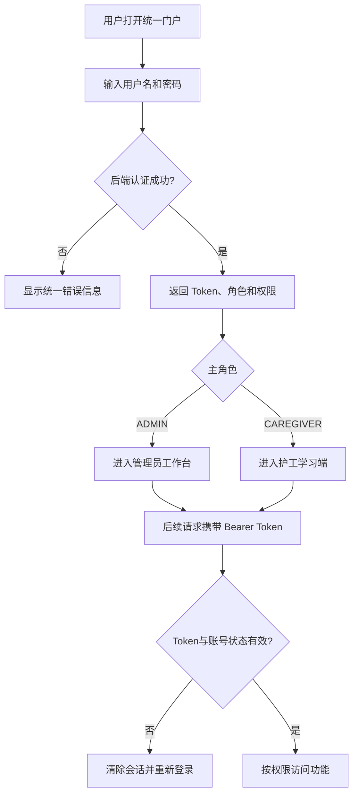
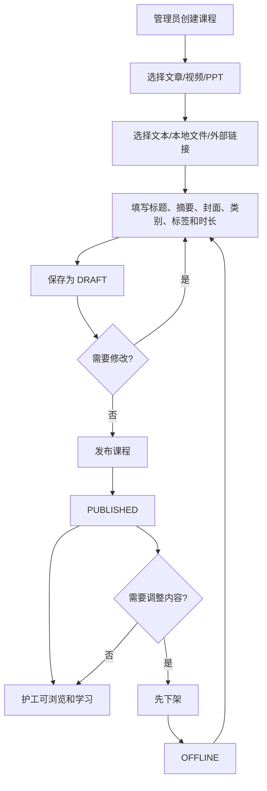
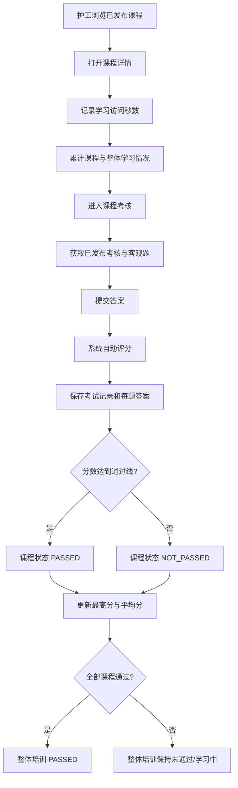
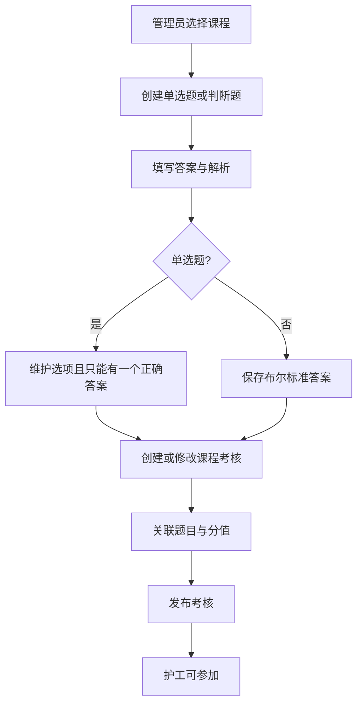
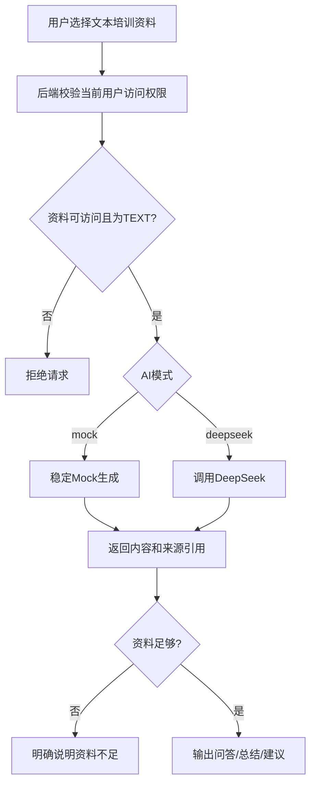
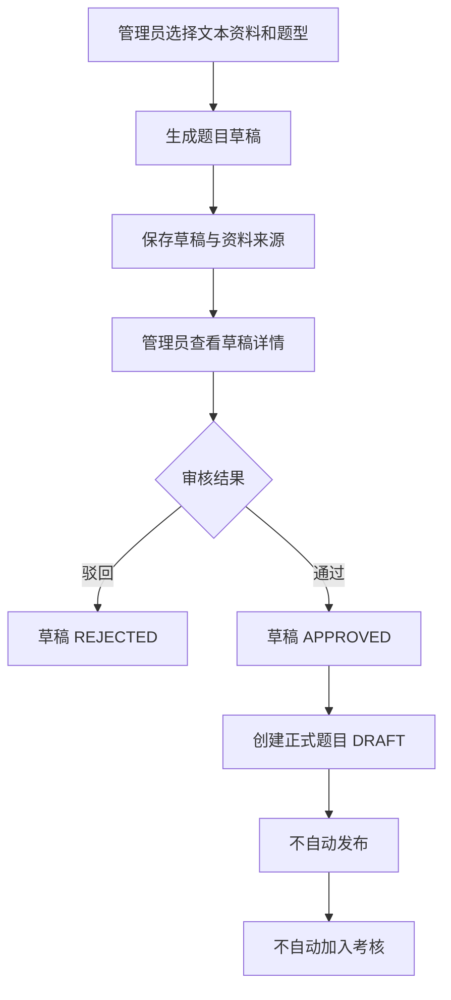
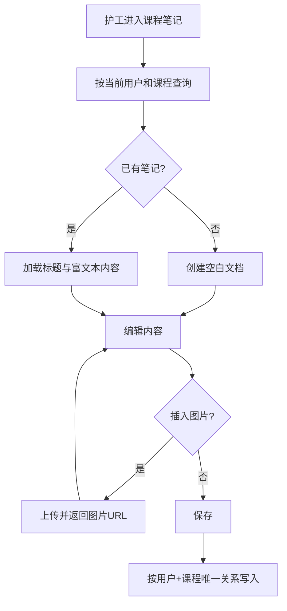
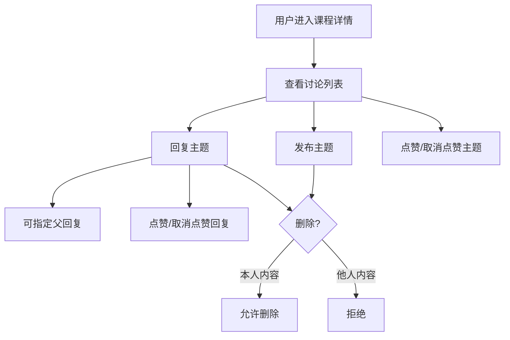
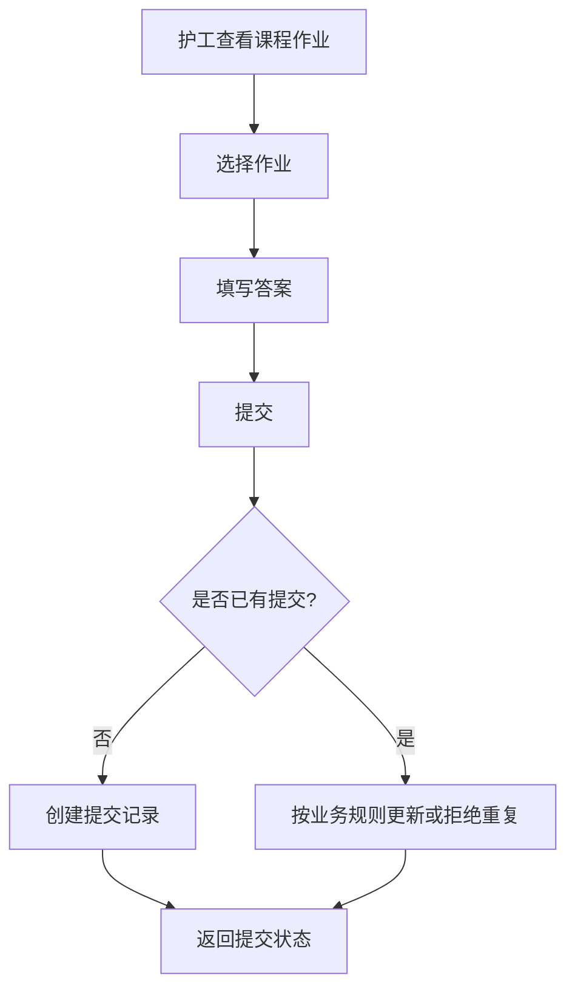
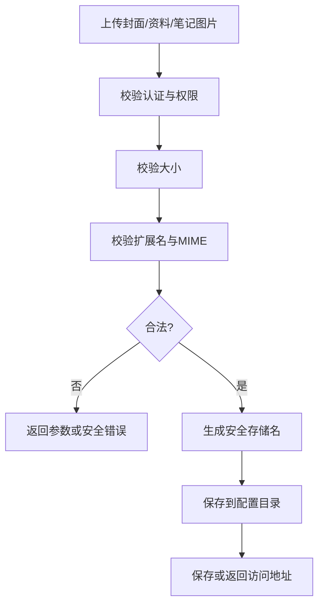

# 业务流程

项目名称：CareNexus 颐联  
版本：轻量版 2.0  
更新时间：2026-07-15

## 1. 登录与角色分流

## 2. 培训资源管理

业务规则：

- 护工只能读取 `PUBLISHED` 资源。
- 已发布资源不能直接修改。
- 重复发布或重复下架返回冲突。
- 发布和下架写入操作日志。

## 3. 逐课学习与考核

## 4. 题库与考核管理

每门课程只保留一份考核关系。系统不支持简答题和人工评分。

## 5. AI 学习辅助

AI 不读取健康数据，也不输出诊断、处方、治疗方案或医疗决策。

## 6. AI 题目草稿审核

重复审核返回冲突。草稿仅支持单选题和判断题。

## 7. 富文本课程笔记

任何用户都不能通过修改请求参数访问其他人的笔记。

## 8. 课程讨论

## 9. 课后作业

## 10. 培训成绩查看

### 护工

1. 查询本人所有课程成绩。
2. 返回每课最高分、平均分、通过状态和尝试次数。
3. 汇总已通过课程数和整体培训状态。
4. 可按课程查看错题。

### 管理员

1. 查询护工成绩列表。
2. 查看各护工课程完成和通过情况。
3. 不直接修改原始考试记录。

## 11. 文件上传

## 12. 范围说明

本流程不包含护理预约、护理订单、家属绑定、医生健康管理和医疗 AI。历史业务流程中的相关图只代表完整版阶段，不属于轻量版当前验收主线。