# 业务流程

项目名称：CareNexus 颐联

任务编号：T-007

文档状态：初稿，已审核，待T-009形成需求基线

更新时间：2026-07-08

## 1. 文档说明

本文档基于 `docs/requirements/软件需求规约.md` 和 `docs/requirements/用例模型.md` 绘制核心业务流程。流程用于先启阶段需求基线准备，不定义接口、数据库表、前后端工程或部署结构。

## 2. 状态流转总览

### 2.1 培训资源状态

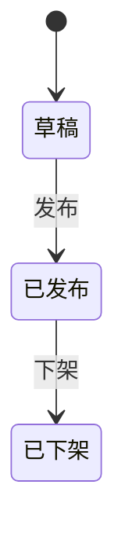

### 2.2 培训学习状态

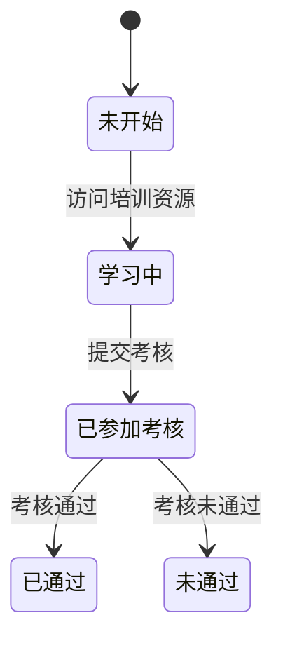

### 2.3 AI 题目草稿状态

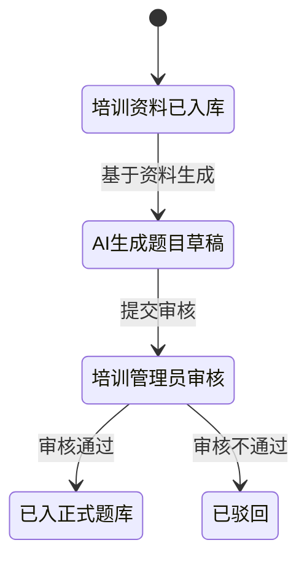

### 2.4 护理订单主状态

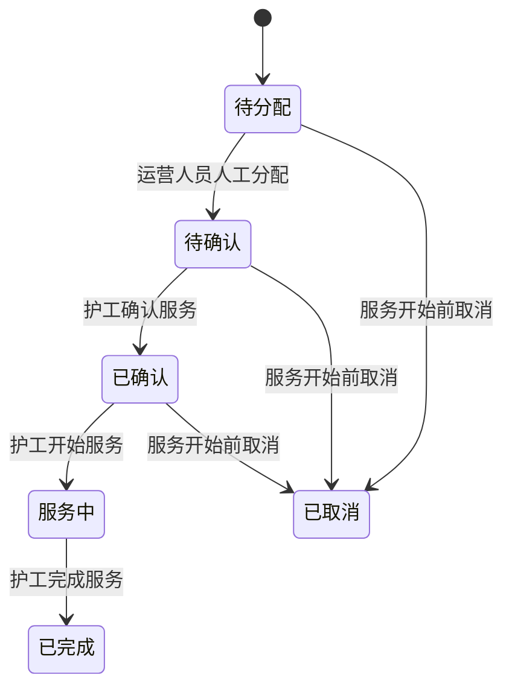

### 2.5 评价状态

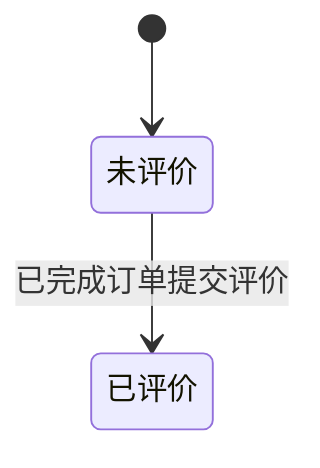

### 2.6 投诉状态

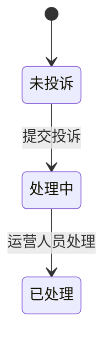

### 2.7 健康预警状态

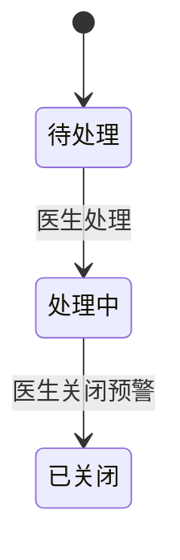

### 2.8 健康评估状态

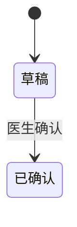

## 3. 培训资源发布流程

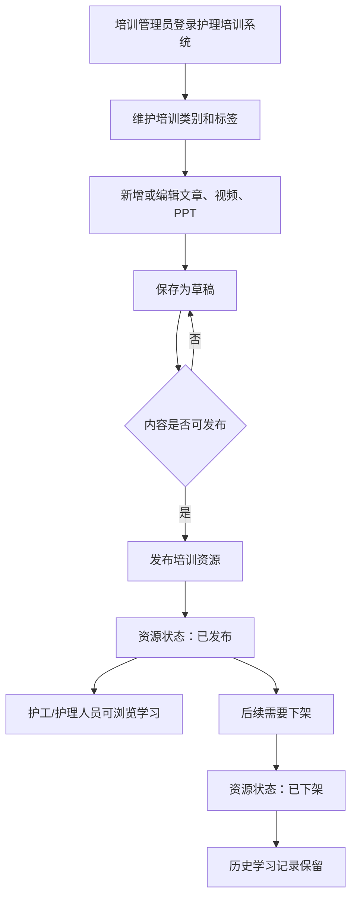

约束：

- 培训资源状态仅包含草稿、已发布、已下架。
- 下架资源不影响历史学习记录。

## 4. 培训学习和考核流程

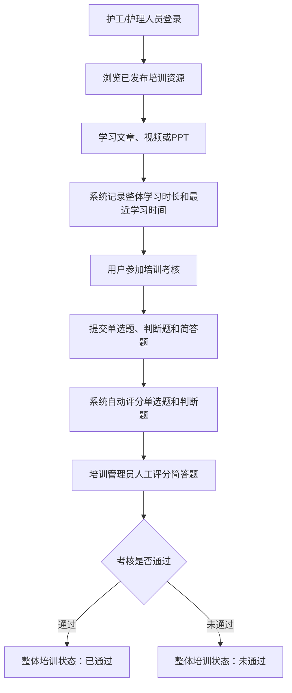

约束：

- MVP 阶段不按文章、视频、PPT 分别计算通过状态。
- 首期只记录用户整体培训状态。
- 简答题未评分时不得直接判定培训通过。

## 5. AI辅助培训与题目草稿生成审核流程

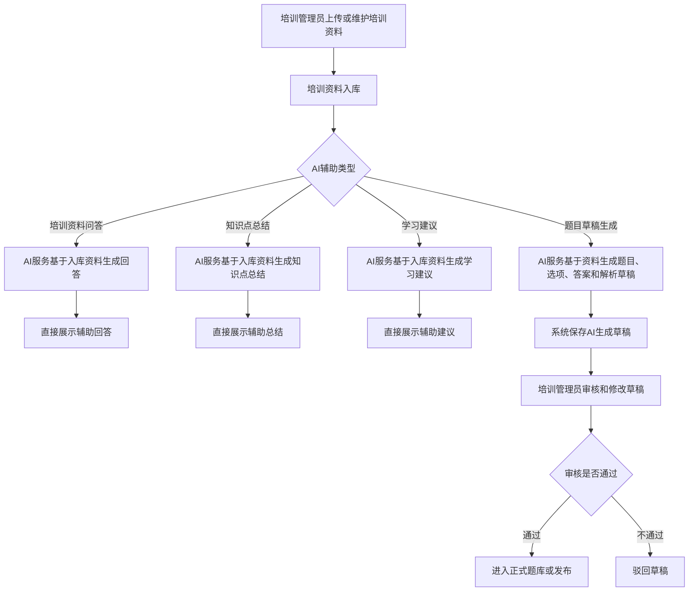

约束：

- AI 仅用于护理培训辅助。
- 培训资料问答、知识点总结和学习建议作为辅助内容直接展示。
- AI 题目必须基于已上传或已入库培训资料生成草稿。
- 只有题目草稿必须经培训管理员审核后才能进入正式题库或考核。
- 不实现医生端 AI 诊断、AI 处方或自动医疗决策。

## 6. 老人和家属绑定流程

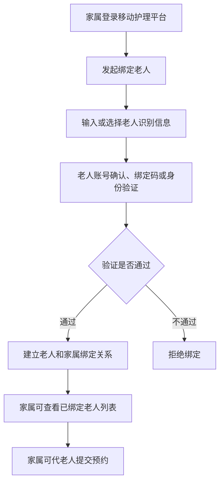

约束：

- MVP 阶段不需要管理员人工审核。
- 具体绑定交互方式在详细设计阶段确定。
- 未绑定的家属不得代老人提交预约。

## 7. 护理服务预约、分配、执行和完成流程

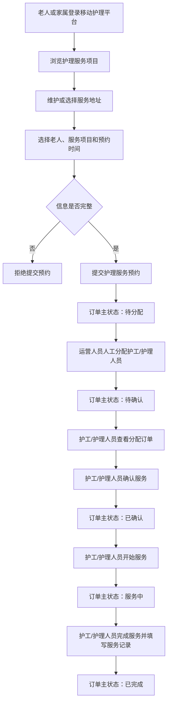

约束：

- MVP 不实现真实支付。
- MVP 不实现智能派单。
- 护工/护理人员只能处理分配给自己的订单。
- 完成服务必须填写简单服务记录。

## 8. 订单取消流程

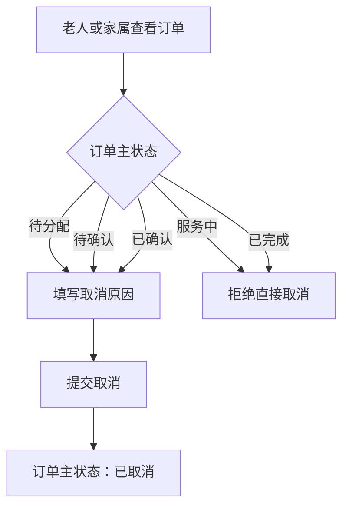

约束：

- 老人或家属可以在服务开始前取消订单。
- 取消时必须记录取消原因。
- 服务中和已完成订单不得直接取消。

## 9. 评价和投诉处理流程

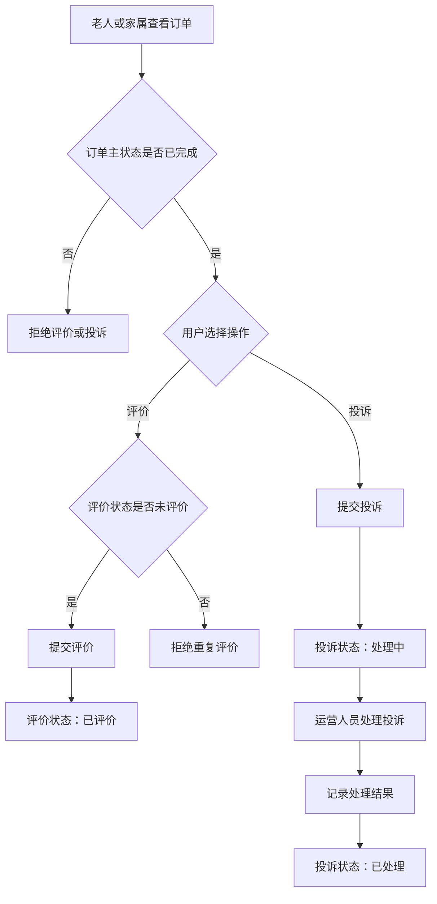

约束：

- 评价状态独立于订单主状态。
- 投诉状态独立于订单主状态。
- 评价和投诉可以独立发生。

## 10. 医生与老人授权流程

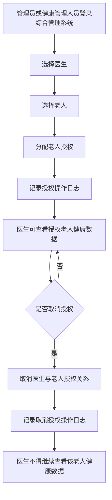

约束：

- 医生只能查看授权老人。
- 授权维护参与者为管理员和健康管理人员。
- 医生本人只能使用已有授权，不能给自己新增授权。
- 授权变更必须记录操作日志。
- 授权取消后医生不得继续访问该老人健康数据。

## 11. 健康记录管理流程

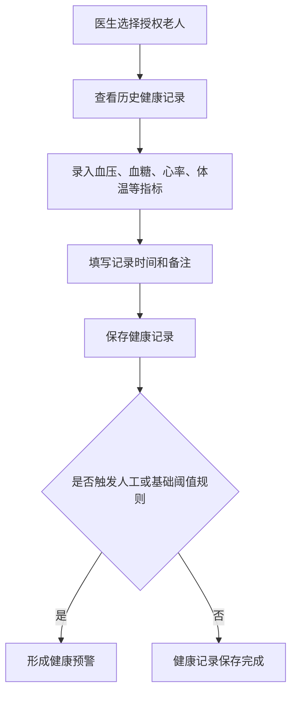

约束：

- 医生只能管理授权老人健康记录。
- 健康记录属于隐私数据。
- 健康预警可由人工或基础阈值规则形成。

## 12. 健康预警处理流程

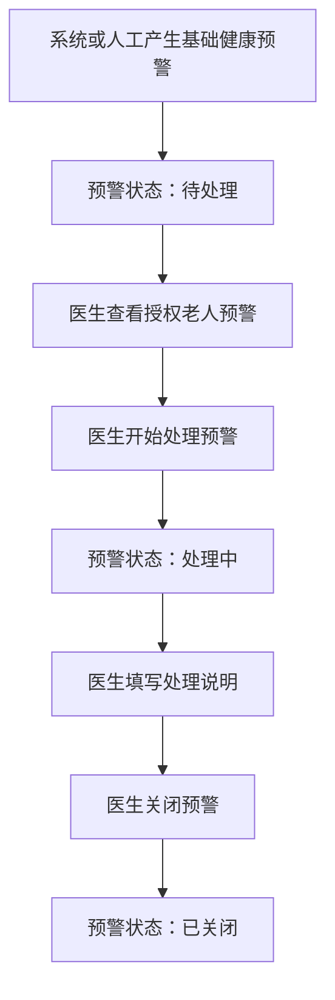

约束：

- 健康预警不等同于医疗诊断。
- 本期不设计 AI 诊断、AI 处方或自动医疗决策。
- 医生只能处理授权老人相关预警。

## 13. 随访、干预和健康评估流程

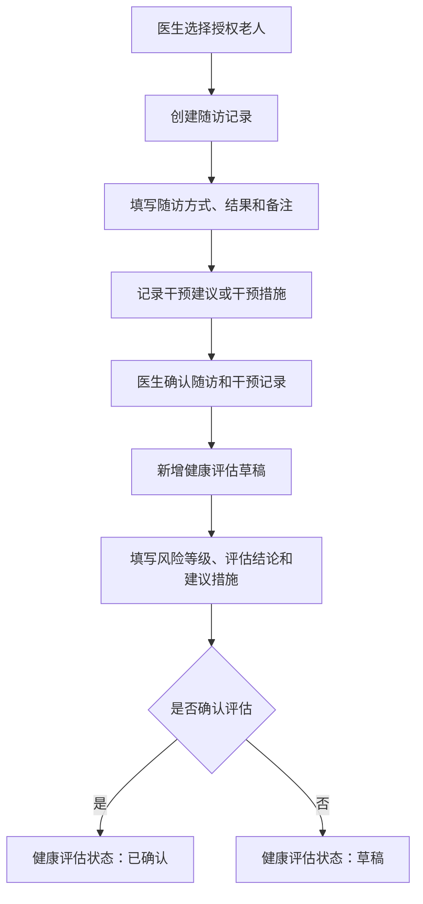

约束：

- 随访和干预记录由医生确认后形成正式记录。
- 健康评估由医生确认后生效。
- MVP 不实现 AI 自动评估。

## 14. 综合管理用户和权限管理流程

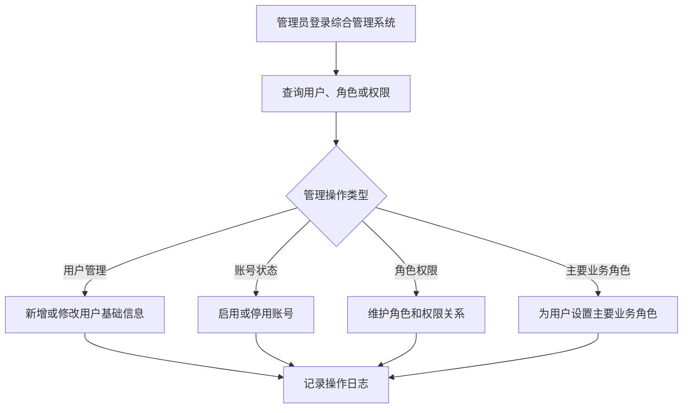

约束：

- MVP 阶段一个账号只有一个主要业务角色。
- 首期不实现复杂多角色切换。
- 账号启停和权限变更等关键操作必须记录日志。

## 15. 流程与用例对应关系

| 业务流程 | 对应用例 |
|---|---|
| 培训资源发布流程 | UC-TRAIN-001, UC-TRAIN-002, UC-TRAIN-003, UC-TRAIN-004, UC-TRAIN-005, UC-ADMIN-005 |
| 培训学习和考核流程 | UC-TRAIN-006, UC-TRAIN-007, UC-TRAIN-008 |
| AI辅助培训与题目草稿生成审核流程 | UC-AI-001, UC-AI-002, UC-AI-003 |
| 老人和家属绑定流程 | UC-MOBILE-001, UC-MOBILE-002 |
| 护理服务预约、分配、执行和完成流程 | UC-MOBILE-003, UC-MOBILE-004, UC-MOBILE-005, UC-MOBILE-007, UC-CARE-001, UC-CARE-002, UC-ADMIN-002, UC-ADMIN-003 |
| 订单取消流程 | UC-MOBILE-006 |
| 评价和投诉处理流程 | UC-MOBILE-008, UC-ADMIN-004 |
| 医生与老人授权流程 | UC-ADMIN-007, UC-DOCTOR-001 |
| 健康记录管理流程 | UC-DOCTOR-002 |
| 健康预警处理流程 | UC-DOCTOR-003 |
| 随访、干预和健康评估流程 | UC-DOCTOR-004 |
| 综合管理用户和权限管理流程 | UC-ADMIN-001, UC-ADMIN-006 |

## 16. 建模约束记录

- 医生端继续保持轻量化。
- 不加入医生端 AI 诊断、AI 处方或自动医疗决策。
- AI 仅用于护理培训辅助。
- AI 题目必须基于已入库培训资料生成草稿。
- 只有 AI 题目草稿必须经培训管理员审核后才能进入正式题库或考核。
- MVP 不实现智能派单。
- 不实现真实支付和真实短信。
- 本文档不创建接口、数据库表或工程目录。
