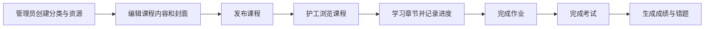
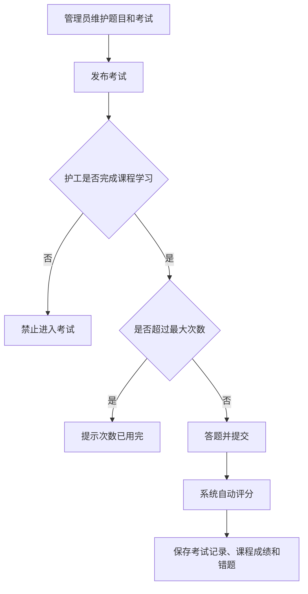
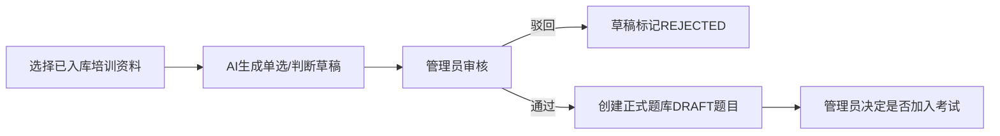

# CareNexus Lite 业务流程

## 培训发布与学习

```mermaid
flowchart LR
  A[管理员创建分类与资源] --> B[编辑课程内容和封面]
  B --> C[发布课程]
  C --> D[护工浏览课程]
  D --> E[学习章节并记录进度]
  E --> F[完成作业]
  F --> G[完成考试]
  G --> H[生成成绩与错题]
```

## 考试流程

```mermaid
flowchart TD
  A[管理员维护题目和考试] --> B[发布考试]
  B --> C{护工是否完成课程学习}
  C -- 否 --> D[禁止进入考试]
  C -- 是 --> E{是否超过最大次数}
  E -- 是 --> F[提示次数已用完]
  E -- 否 --> G[答题并提交]
  G --> H[系统自动评分]
  H --> I[保存考试记录、课程成绩和错题]
```

## AI题目草稿

```mermaid
flowchart LR
  A[选择已入库培训资料] --> B[AI生成单选/判断草稿]
  B --> C[管理员审核]
  C -- 驳回 --> D[草稿标记REJECTED]
  C -- 通过 --> E[创建正式题库DRAFT题目]
  E --> F[管理员决定是否加入考试]
```

## 课程互动

护工可发布课程主题、回复、点赞；只能删除本人发布的主题或回复。笔记按“用户+课程”保存，支持富文本和图片，课程下架后历史笔记、学习和考试记录仍保留。
