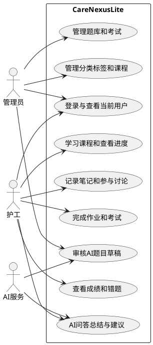

# CareNexus Lite 用例模型

## 参与者

- 管理员
- 护工
- AI服务（护理培训辅助外部能力）

## 核心用例

| 编号 | 名称 | 参与者 | 主要结果 |
| --- | --- | --- | --- |
| UC-AUTH-001 | 登录 | 管理员、护工 | 获得JWT并进入对应工作台 |
| UC-TRAIN-001 | 管理培训资源 | 管理员 | 资源创建、编辑、发布或下架 |
| UC-TRAIN-002 | 管理考试 | 管理员 | 维护题目、考试、次数和发布状态 |
| UC-LEARN-001 | 学习课程 | 护工 | 记录访问、进度和最近学习时间 |
| UC-LEARN-002 | 课程互动 | 护工 | 笔记、讨论、回复和点赞被保存 |
| UC-EXAM-001 | 完成作业 | 护工 | 自动评分，可无限重做 |
| UC-EXAM-002 | 参加考试 | 护工 | 满足学习条件并在次数内提交 |
| UC-EXAM-003 | 查看学习结果 | 护工 | 查看成绩、平均分、状态和错题 |
| UC-AI-001 | AI学习辅助 | 护工、AI服务 | 基于资料给出问答、总结或建议 |
| UC-AI-002 | AI题目草稿审核 | 管理员、AI服务 | 通过后创建正式题库草稿 |
