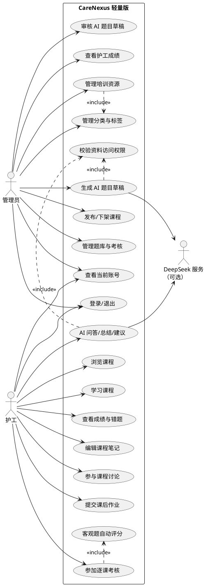

# 用例模型

项目名称：CareNexus 颐联  
版本：轻量版 2.0  
更新时间：2026-07-15

## 1. 参与者

| 参与者 | 说明 |
|---|---|
| 管理员 | 维护培训内容、题库考核、AI 草稿和培训成绩 |
| 护工 | 学习课程、参加考核、维护笔记、参与互动和使用 AI 学习辅助 |
| DeepSeek 服务 | 可选外部 AI 提供方；Mock 模式下不参与运行 |
| MySQL | 保存账号、权限、培训、考核、互动和审计数据 |
| 本地文件系统 | 保存课程封面、资料和笔记图片 |

## 2. 系统用例图

## 3. 管理员用例

### UC-A01 登录管理端

- 前置条件：账号状态正常。
- 主流程：输入凭证，后端校验 BCrypt 密码，返回 Token、角色和权限；前端进入工作台。
- 异常：错误密码、停用账号、删除账号返回 401。

### UC-A02 管理分类与标签

- 新增、修改、启用和停用分类或标签。
- 停用项不应作为护工正常浏览条件展示。

### UC-A03 管理培训资源

- 创建文章、视频或 PPT 资源。
- 选择文本、本地文件或外部链接。
- 设置课程标题、摘要、封面、类别、标签和时长。
- 草稿可编辑；已发布资源需先下架再修改。

### UC-A04 发布与下架课程

- `DRAFT -> PUBLISHED`。
- `PUBLISHED -> OFFLINE`。
- `OFFLINE -> PUBLISHED`。
- 重复操作返回冲突。

### UC-A05 管理题库与考核

- 创建单选题和判断题。
- 维护选项、标准答案和解析。
- 每门课程维护一份考核并设置题目。
- 发布考核供护工参加。

### UC-A06 生成并审核 AI 题目草稿

- 选择有权访问的文本课程。
- 生成单选题或判断题草稿。
- 查看来源、内容和状态。
- 审核通过后创建 `DRAFT` 正式题目；驳回不创建题目。

### UC-A07 查看培训成绩

- 查看护工的课程数量、通过数量、最高分、平均分和整体培训状态。
- 不修改护工考试原始记录。

## 4. 护工用例

### UC-C01 浏览和学习课程

- 只显示已发布课程。
- 查看课程详情、内容、标签、学习时长和相关考核。
- 记录本次访问秒数并更新个人学习记录。

### UC-C02 参加逐课考核

- 获取课程对应的已发布考核。
- 提交单选题和判断题答案。
- 系统自动评分并保存考试记录。
- 返回分数、通过状态和题目解析。

### UC-C03 查看成绩和错题

- 查看各课程最高分、平均分、通过状态和整体培训状态。
- 按课程查看本人答错题目、答案和解析。

### UC-C04 编辑课程笔记

- 为每门课程维护一份个人富文本笔记。
- 上传笔记图片。
- 只能读取和修改本人笔记。

### UC-C05 参与课程讨论

- 查看课程主题和回复。
- 创建主题、回复和嵌套回复。
- 点赞或取消点赞。
- 删除本人创建的内容。

### UC-C06 提交课后作业

- 查看课程作业。
- 提交个人答案。
- 同一作业与用户保持唯一提交关系。

### UC-C07 使用 AI 学习辅助

- 基于已发布文本课程提问。
- 生成课程总结。
- 根据学习情况获得建议。
- 返回内容必须包含来源引用，资料不足时明确说明。

## 5. 权限矩阵

| 用例 | 管理员 | 护工 |
|---|---:|---:|
| 登录、当前用户、退出 | √ | √ |
| 管理分类标签 | √ | × |
| 创建、修改、发布资源 | √ | × |
| 浏览已发布资源 | √ | √ |
| 管理题库与考核 | √ | × |
| 参加考核 | × | √ |
| 查看本人成绩与错题 | × | √ |
| 查看全部护工成绩 | √ | × |
| 管理个人笔记 | 可访问个人范围 | √ |
| 课程讨论与作业 | 可按权限参与 | √ |
| AI 问答、总结、建议 | √ | √ |
| AI 题目草稿生成与审核 | √ | × |

## 6. 非用例范围

本模型不包含护理服务预约、护理订单、老人家属绑定、医生授权、健康记录、健康预警、随访干预和医疗 AI 决策。历史文档中的相关用例属于完整版阶段，不适用于轻量版。