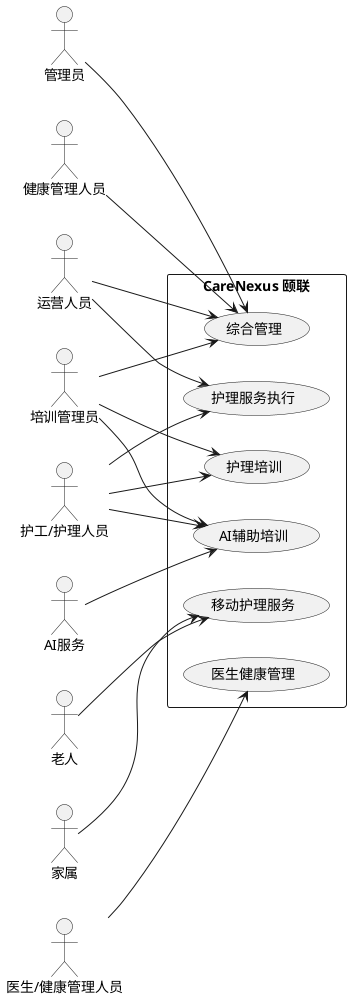
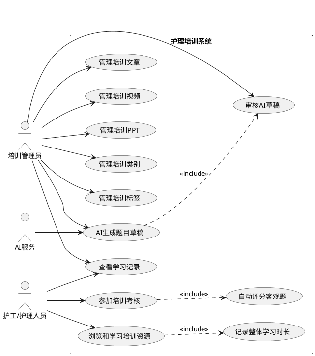
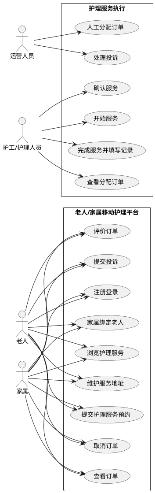
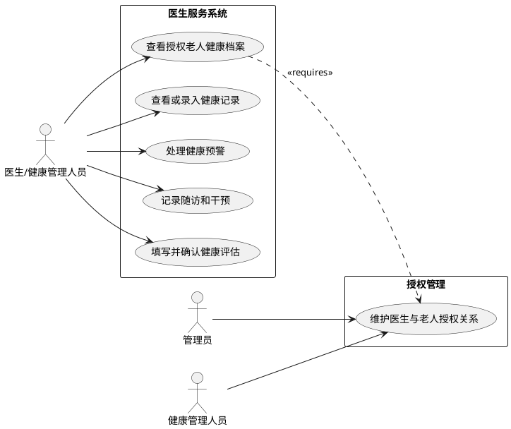
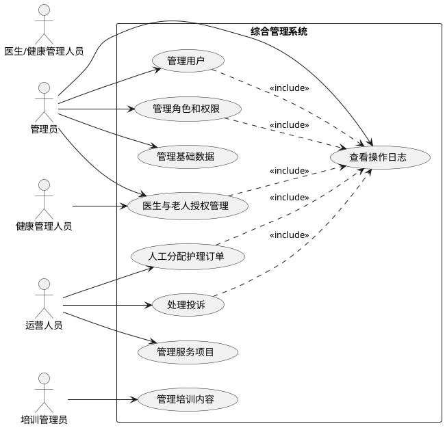

# 用例模型

项目名称：CareNexus 颐联

任务编号：T-007

文档状态：需求基线 v1.0，已确认

更新时间：2026-07-08

## 1. 文档说明

本文档基于 `docs/requirements/软件需求规约.md` 建立用例模型，用于把已确认的软件需求转化为参与者、系统边界、用例图、关键用例描述和需求追踪关系。

本文档不新增业务范围，不定义接口路径、数据库表结构、Controller、Service 或工程目录。

## 2. 系统边界

CareNexus 颐联系统在 MVP 阶段包含以下业务边界：

- 护理培训系统：培训资源、学习记录、培训考核和 AI 辅助培训。
- 老人/家属移动护理平台：注册登录、老人绑定、服务浏览、地址、预约、订单、评价和投诉。
- 护工/护理人员服务执行：查看分配订单、确认服务、开始服务、完成服务和填写服务记录。
- 医生服务系统：授权老人健康档案、健康记录、健康预警、随访、干预和健康评估。
- 综合管理系统：用户、角色、权限、服务项目、订单分配、培训内容、基础数据、操作日志和医生老人授权关系。
- AI 辅助培训外部服务：仅作为护理培训辅助服务，基于已入库培训资料生成问答、总结、建议和题目草稿。

## 3. 参与者清单

| 参与者 | 类型 | 说明 |
|---|---|---|
| 管理员 | 主参与者 | 管理用户、角色、权限、账号状态、基础数据、操作日志和医生老人授权关系 |
| 运营人员 | 主参与者 | 管理服务项目，人工分配护理订单，处理投诉 |
| 培训管理员 | 主参与者 | 管理培训类别、标签、文章、视频、PPT、考核题目和 AI 草稿审核 |
| 护工/护理人员 | 主参与者 | 学习培训资源、参加考核、查看学习记录，并执行分配给自己的护理订单 |
| 老人 | 主参与者 | 浏览服务、维护地址、提交预约、查看订单、评价和投诉 |
| 家属 | 主参与者 | 绑定老人，代老人浏览服务、预约护理、查看订单、评价和投诉 |
| 医生/健康管理人员 | 主参与者 | 查看授权老人健康档案，录入健康记录，处理预警，记录随访、干预和评估；授权维护场景中仅健康管理人员可维护授权，医生本人只能使用已有授权 |
| AI服务 | 外部辅助参与者 | 基于已入库培训资料提供护理培训辅助能力 |

## 4. 用例编号规则

| 编号前缀 | 含义 |
|---|---|
| `UC-TRAIN-xxx` | 护理培训系统用例 |
| `UC-MOBILE-xxx` | 老人/家属移动护理平台用例 |
| `UC-CARE-xxx` | 护工/护理人员服务执行用例 |
| `UC-DOCTOR-xxx` | 医生服务系统用例 |
| `UC-ADMIN-xxx` | 综合管理系统用例 |
| `UC-AI-xxx` | AI 辅助培训用例 |

## 5. 用例总览

### 5.1 护理培训系统用例

| 用例编号 | 用例名称 | 参与者 | 对应需求编号 |
|---|---|---|---|
| UC-TRAIN-001 | 管理培训类别 | 培训管理员 | REQ-TRAIN-001 |
| UC-TRAIN-002 | 管理培训标签 | 培训管理员 | REQ-TRAIN-002 |
| UC-TRAIN-003 | 管理培训文章 | 培训管理员 | REQ-TRAIN-003 |
| UC-TRAIN-004 | 管理培训视频 | 培训管理员 | REQ-TRAIN-004 |
| UC-TRAIN-005 | 管理培训 PPT | 培训管理员 | REQ-TRAIN-005 |
| UC-TRAIN-006 | 浏览和学习培训资源 | 护工/护理人员 | REQ-TRAIN-003, REQ-TRAIN-004, REQ-TRAIN-005, REQ-TRAIN-006 |
| UC-TRAIN-007 | 查看学习记录 | 护工/护理人员、培训管理员 | REQ-TRAIN-006 |
| UC-TRAIN-008 | 参加培训考核 | 护工/护理人员、培训管理员 | REQ-TRAIN-007 |

### 5.2 AI 辅助培训用例

| 用例编号 | 用例名称 | 参与者 | 对应需求编号 |
|---|---|---|---|
| UC-AI-001 | 培训资料问答 | 护工/护理人员、培训管理员、AI服务 | REQ-AI-001 |
| UC-AI-002 | 生成知识点总结和学习建议 | 护工/护理人员、培训管理员、AI服务 | REQ-AI-001 |
| UC-AI-003 | AI 生成题目草稿并审核 | 培训管理员、AI服务 | REQ-AI-001, REQ-TRAIN-007, REQ-ADMIN-004 |

### 5.3 老人/家属移动护理平台用例

| 用例编号 | 用例名称 | 参与者 | 对应需求编号 |
|---|---|---|---|
| UC-MOBILE-001 | 注册登录移动护理平台 | 老人、家属 | REQ-MOBILE-001 |
| UC-MOBILE-002 | 家属绑定老人 | 老人、家属 | REQ-MOBILE-002 |
| UC-MOBILE-003 | 浏览护理服务项目 | 老人、家属 | REQ-MOBILE-003 |
| UC-MOBILE-004 | 维护服务地址 | 老人、家属 | REQ-MOBILE-004 |
| UC-MOBILE-005 | 提交护理服务预约 | 老人、家属 | REQ-MOBILE-005 |
| UC-MOBILE-006 | 取消护理服务订单 | 老人、家属 | REQ-MOBILE-006 |
| UC-MOBILE-007 | 查看订单 | 老人、家属 | REQ-MOBILE-006 |
| UC-MOBILE-008 | 评价和投诉 | 老人、家属、运营人员 | REQ-MOBILE-006, REQ-ADMIN-003 |

### 5.4 护工/护理人员服务执行用例

| 用例编号 | 用例名称 | 参与者 | 对应需求编号 |
|---|---|---|---|
| UC-CARE-001 | 查看分配订单 | 护工/护理人员 | REQ-CARE-001 |
| UC-CARE-002 | 执行护理订单 | 护工/护理人员 | REQ-CARE-001, REQ-CARE-002 |

### 5.5 医生服务系统用例

| 用例编号 | 用例名称 | 参与者 | 对应需求编号 |
|---|---|---|---|
| UC-DOCTOR-001 | 医生查看授权老人健康档案 | 医生/健康管理人员 | REQ-DOCTOR-001, REQ-ADMIN-006 |
| UC-DOCTOR-002 | 管理健康记录 | 医生/健康管理人员 | REQ-DOCTOR-002 |
| UC-DOCTOR-003 | 处理健康预警 | 医生/健康管理人员 | REQ-DOCTOR-003 |
| UC-DOCTOR-004 | 记录随访、干预和健康评估 | 医生/健康管理人员 | REQ-DOCTOR-004, REQ-DOCTOR-005 |

### 5.6 综合管理系统用例

| 用例编号 | 用例名称 | 参与者 | 对应需求编号 |
|---|---|---|---|
| UC-ADMIN-001 | 用户、角色和权限管理 | 管理员 | REQ-ADMIN-001, REQ-ADMIN-002 |
| UC-ADMIN-002 | 管理服务项目 | 管理员、运营人员 | REQ-ADMIN-003 |
| UC-ADMIN-003 | 人工分配护理订单 | 运营人员 | REQ-ADMIN-003 |
| UC-ADMIN-004 | 处理投诉 | 运营人员 | REQ-ADMIN-003, REQ-MOBILE-006 |
| UC-ADMIN-005 | 管理培训内容 | 培训管理员、管理员 | REQ-ADMIN-004 |
| UC-ADMIN-006 | 管理基础数据和操作日志 | 管理员 | REQ-ADMIN-005 |
| UC-ADMIN-007 | 医生与老人授权管理 | 管理员、健康管理人员 | REQ-ADMIN-006 |

## 6. 用例图

### 6.1 系统总体用例图

### 6.2 护理培训系统用例图

### 6.3 移动护理和服务执行用例图

### 6.4 医生服务系统用例图

### 6.5 综合管理系统用例图

## 7. 关键用例详细说明

### 7.1 UC-TRAIN-006 浏览和学习培训资源

| 项目 | 内容 |
|---|---|
| 用例编号 | UC-TRAIN-006 |
| 用例名称 | 浏览和学习培训资源 |
| 参与者 | 护工/护理人员 |
| 对应需求编号 | REQ-TRAIN-003, REQ-TRAIN-004, REQ-TRAIN-005, REQ-TRAIN-006 |
| 前置条件 | 护工/护理人员已登录；培训资源处于已发布状态 |
| 后置条件 | 系统记录整体学习时长、最近学习时间和资源访问历史 |

基本流程：

1. 护工/护理人员进入护理培训系统。
2. 系统展示已发布的文章、视频和 PPT。
3. 护工/护理人员按类别或标签筛选培训资源。
4. 护工/护理人员打开培训资源进行学习。
5. 系统记录资源访问历史。
6. 系统累计用户整体学习时长并更新最近学习时间。

异常或备选流程：

- 资源已下架：系统不允许继续访问，但历史学习记录保留。
- 账号停用：系统拒绝访问培训系统。
- 用户未登录：系统提示先登录。

### 7.2 UC-TRAIN-008 参加培训考核

| 项目 | 内容 |
|---|---|
| 用例编号 | UC-TRAIN-008 |
| 用例名称 | 参加培训考核 |
| 参与者 | 护工/护理人员、培训管理员 |
| 对应需求编号 | REQ-TRAIN-007 |
| 前置条件 | 用户已登录；考核题目已发布 |
| 后置条件 | 系统记录考核分数、通过状态和提交时间；通过后整体培训状态记为已通过 |

基本流程：

1. 护工/护理人员进入培训考核。
2. 系统展示单选题和判断题。
3. 护工/护理人员提交答案。
4. 系统自动评分单选题和判断题。
5. 系统计算考核结果。
7. 考核通过后，系统将整体培训状态标记为已通过。

异常或备选流程：

- 客观题答案缺失：系统拒绝提交考核。
- 考核未通过：系统记录未通过状态，可按后续详细规则重考。
- 题目已下架或不可用：系统拒绝提交并提示。

### 7.3 UC-AI-003 AI 生成题目草稿并审核

| 项目 | 内容 |
|---|---|
| 用例编号 | UC-AI-003 |
| 用例名称 | AI 生成题目草稿并审核 |
| 参与者 | 培训管理员、AI服务 |
| 对应需求编号 | REQ-AI-001, REQ-TRAIN-007, REQ-ADMIN-004 |
| 前置条件 | 培训资料或题库资料已上传或入库 |
| 后置条件 | 审核通过的草稿进入正式题库或发布；未通过的草稿被驳回 |

基本流程：

1. 培训管理员选择已入库培训资料。
2. 培训管理员发起题目草稿生成。
3. AI服务基于已入库资料生成题目、选项、答案和解析草稿。
4. 系统将生成结果标记为草稿。
5. 培训管理员审核并修改草稿。
6. 审核通过后，草稿进入正式题库或发布。

异常或备选流程：

- 未选择入库资料：系统不得生成题目草稿。
- AI 输出与资料范围不一致：培训管理员驳回或修改。
- 草稿未审核：不得进入正式题库或考核。

### 7.4 UC-MOBILE-002 家属绑定老人

| 项目 | 内容 |
|---|---|
| 用例编号 | UC-MOBILE-002 |
| 用例名称 | 家属绑定老人 |
| 参与者 | 家属、老人 |
| 对应需求编号 | REQ-MOBILE-002 |
| 前置条件 | 家属已登录；老人账号或身份验证方式可用 |
| 后置条件 | 家属可查看已绑定老人列表，并可代老人提交预约 |

基本流程：

1. 家属发起老人绑定。
2. 系统要求通过老人账号确认、绑定码或身份验证完成绑定。
3. 老人完成确认或系统完成身份验证。
4. 系统建立老人和家属绑定关系。
5. 家属查看已绑定老人列表。

异常或备选流程：

- 绑定验证失败：系统拒绝建立绑定。
- 家属未绑定老人即提交预约：系统拒绝提交预约。
- 老人或家属账号被停用：系统拒绝绑定操作。

### 7.5 UC-MOBILE-005 提交护理服务预约

| 项目 | 内容 |
|---|---|
| 用例编号 | UC-MOBILE-005 |
| 用例名称 | 提交护理服务预约 |
| 参与者 | 老人、家属 |
| 对应需求编号 | REQ-MOBILE-003, REQ-MOBILE-004, REQ-MOBILE-005 |
| 前置条件 | 用户已登录；服务项目可用；服务地址已维护；家属代老人预约时已完成绑定 |
| 后置条件 | 系统创建待分配订单 |

基本流程：

1. 老人或家属浏览护理服务项目。
2. 用户选择服务项目。
3. 用户选择老人、服务地址和预约时间。
4. 用户提交预约。
5. 系统校验绑定关系、服务地址和预约信息。
6. 系统创建订单，订单主状态为待分配。

异常或备选流程：

- 家属未绑定老人：系统拒绝提交预约。
- 未选择服务地址：系统拒绝提交预约。
- 服务项目不可用：系统拒绝提交预约。
- MVP 不进入支付流程。

### 7.6 UC-CARE-002 执行护理订单

| 项目 | 内容 |
|---|---|
| 用例编号 | UC-CARE-002 |
| 用例名称 | 执行护理订单 |
| 参与者 | 护工/护理人员 |
| 对应需求编号 | REQ-CARE-001, REQ-CARE-002 |
| 前置条件 | 订单已经由运营人员分配给护工/护理人员，订单主状态为待确认 |
| 后置条件 | 护理服务完成并形成简单服务记录 |

基本流程：

1. 护工/护理人员查看已分配给自己的待确认订单。
2. 护工/护理人员确认服务，订单主状态变为已确认。
3. 护工/护理人员开始服务，订单主状态变为服务中。
4. 护工/护理人员完成服务并填写简单服务记录。
5. 订单主状态变为已完成。

异常或备选流程：

- 订单已取消：不得继续确认或执行。
- 护工/护理人员操作非本人订单：系统拒绝操作。
- 未填写服务记录：不得完成服务。
- MVP 不实现智能派单。

### 7.7 UC-MOBILE-008 评价和投诉

| 项目 | 内容 |
|---|---|
| 用例编号 | UC-MOBILE-008 |
| 用例名称 | 评价和投诉 |
| 参与者 | 老人、家属、运营人员 |
| 对应需求编号 | REQ-MOBILE-006, REQ-ADMIN-003 |
| 前置条件 | 订单主状态为已完成 |
| 后置条件 | 评价状态变为已评价，或投诉状态经处理后变为已处理 |

基本流程：

1. 老人或家属查看已完成订单。
2. 用户提交评价，评价状态由未评价变为已评价。
3. 用户也可以提交投诉，投诉状态由未投诉变为处理中。
4. 运营人员查看投诉。
5. 运营人员处理投诉并填写处理结果。
6. 投诉状态变为已处理。

异常或备选流程：

- 未完成订单提交评价：系统拒绝评价。
- 已评价订单重复评价：系统拒绝重复评价。
- 评价和投诉独立发生，不改变订单主状态。

### 7.8 UC-DOCTOR-001 医生查看授权老人健康档案

| 项目 | 内容 |
|---|---|
| 用例编号 | UC-DOCTOR-001 |
| 用例名称 | 医生查看授权老人健康档案 |
| 参与者 | 医生/健康管理人员 |
| 对应需求编号 | REQ-DOCTOR-001, REQ-ADMIN-006 |
| 前置条件 | 医生已登录；医生与老人存在有效授权关系 |
| 后置条件 | 医生查看授权老人健康档案和最近健康记录 |

基本流程：

1. 医生登录医生服务系统。
2. 系统加载医生已授权老人列表。
3. 医生选择老人。
4. 系统展示老人基础信息、慢病标签、健康摘要和最近健康记录。

异常或备选流程：

- 医生访问未授权老人：系统拒绝访问。
- 授权已取消：系统拒绝继续查看该老人健康数据。
- 健康隐私不得输出到日志。

### 7.9 UC-DOCTOR-003 处理健康预警

| 项目 | 内容 |
|---|---|
| 用例编号 | UC-DOCTOR-003 |
| 用例名称 | 处理健康预警 |
| 参与者 | 医生/健康管理人员 |
| 对应需求编号 | REQ-DOCTOR-003 |
| 前置条件 | 医生已登录；预警属于授权老人；预警状态为待处理 |
| 后置条件 | 预警状态变为已关闭，并记录处理说明 |

基本流程：

1. 医生查看授权老人待处理预警。
2. 医生接收或处理预警。
3. 系统将预警状态由待处理变为处理中。
4. 医生填写处理说明。
5. 医生关闭预警。
6. 系统将预警状态变为已关闭。

异常或备选流程：

- 医生查看未授权老人预警：系统拒绝访问。
- 预警不等同于医疗诊断。
- 本期不设计 AI 诊断、AI 处方或自动医疗决策。

### 7.10 UC-DOCTOR-004 记录随访、干预和健康评估

| 项目 | 内容 |
|---|---|
| 用例编号 | UC-DOCTOR-004 |
| 用例名称 | 记录随访、干预和健康评估 |
| 参与者 | 医生/健康管理人员 |
| 对应需求编号 | REQ-DOCTOR-004, REQ-DOCTOR-005 |
| 前置条件 | 医生已登录；老人处于医生授权范围内 |
| 后置条件 | 随访、干预记录保存；健康评估由草稿变为已确认 |

基本流程：

1. 医生选择授权老人。
2. 医生创建随访记录。
3. 医生填写随访方式、随访结果和备注。
4. 医生记录干预建议或干预措施。
5. 医生新增健康评估草稿。
6. 医生填写风险等级、评估结论和建议措施。
7. 医生确认健康评估，评估状态由草稿变为已确认。

异常或备选流程：

- 医生未获授权：系统拒绝记录。
- 健康评估未确认：仅作为草稿，不形成正式记录。
- MVP 不实现 AI 自动评估。

### 7.11 UC-ADMIN-001 用户、角色和权限管理

| 项目 | 内容 |
|---|---|
| 用例编号 | UC-ADMIN-001 |
| 用例名称 | 用户、角色和权限管理 |
| 参与者 | 管理员 |
| 对应需求编号 | REQ-ADMIN-001, REQ-ADMIN-002 |
| 前置条件 | 管理员已登录综合管理系统 |
| 后置条件 | 用户、角色、权限或账号状态被更新，关键操作记录日志 |

基本流程：

1. 管理员进入综合管理系统。
2. 管理员查询用户、角色或权限。
3. 管理员新增或修改用户基础信息。
4. 管理员设置用户主要业务角色。
5. 管理员维护角色和权限关系。
6. 管理员启用或停用账号。
7. 系统记录关键操作日志。

异常或备选流程：

- 非管理员访问权限管理：系统拒绝访问。
- 账号被停用：用户不得继续登录或操作。
- 首期不实现复杂多角色切换。

### 7.12 UC-ADMIN-007 医生与老人授权管理

| 项目 | 内容 |
|---|---|
| 用例编号 | UC-ADMIN-007 |
| 用例名称 | 医生与老人授权管理 |
| 参与者 | 管理员、健康管理人员 |
| 对应需求编号 | REQ-ADMIN-006 |
| 前置条件 | 管理员或健康管理人员已登录；医生和老人信息存在 |
| 后置条件 | 医生与老人授权关系被创建或取消，并记录操作日志 |

基本流程：

1. 管理员或健康管理人员进入授权管理。
2. 选择医生。
3. 选择需要授权的老人。
4. 系统建立医生与老人授权关系。
5. 医生可查看授权老人健康档案。
6. 授权变更记录操作日志。

异常或备选流程：

- 取消授权：系统取消医生与老人授权关系，并记录日志。
- 授权取消后医生继续访问老人健康数据：系统拒绝访问。
- 授权对象不存在或账号停用：系统拒绝授权。
- 医生本人只能使用已有授权，不得为自己新增老人授权。

## 8. 需求与用例追踪表

| 用例编号 | 用例名称 | 参与者 | 对应需求编号 | 对应业务流程 |
|---|---|---|---|---|
| UC-TRAIN-001 | 管理培训类别 | 培训管理员 | REQ-TRAIN-001 | 培训资源发布流程 |
| UC-TRAIN-002 | 管理培训标签 | 培训管理员 | REQ-TRAIN-002 | 培训资源发布流程 |
| UC-TRAIN-003 | 管理培训文章 | 培训管理员 | REQ-TRAIN-003 | 培训资源发布流程 |
| UC-TRAIN-004 | 管理培训视频 | 培训管理员 | REQ-TRAIN-004 | 培训资源发布流程 |
| UC-TRAIN-005 | 管理培训 PPT | 培训管理员 | REQ-TRAIN-005 | 培训资源发布流程 |
| UC-TRAIN-006 | 浏览和学习培训资源 | 护工/护理人员 | REQ-TRAIN-003, REQ-TRAIN-004, REQ-TRAIN-005, REQ-TRAIN-006 | 培训学习和考核流程 |
| UC-TRAIN-007 | 查看学习记录 | 护工/护理人员、培训管理员 | REQ-TRAIN-006 | 培训学习和考核流程 |
| UC-TRAIN-008 | 参加培训考核 | 护工/护理人员、培训管理员 | REQ-TRAIN-007 | 培训学习和考核流程 |
| UC-AI-001 | 培训资料问答 | 护工/护理人员、培训管理员、AI服务 | REQ-AI-001 | AI辅助培训与题目草稿生成审核流程 |
| UC-AI-002 | 生成知识点总结和学习建议 | 护工/护理人员、培训管理员、AI服务 | REQ-AI-001 | AI辅助培训与题目草稿生成审核流程 |
| UC-AI-003 | AI 生成题目草稿并审核 | 培训管理员、AI服务 | REQ-AI-001, REQ-TRAIN-007, REQ-ADMIN-004 | AI辅助培训与题目草稿生成审核流程 |
| UC-MOBILE-001 | 注册登录移动护理平台 | 老人、家属 | REQ-MOBILE-001 | 老人和家属绑定流程 |
| UC-MOBILE-002 | 家属绑定老人 | 老人、家属 | REQ-MOBILE-002 | 老人和家属绑定流程 |
| UC-MOBILE-003 | 浏览护理服务项目 | 老人、家属 | REQ-MOBILE-003 | 护理服务预约、分配、执行和完成流程 |
| UC-MOBILE-004 | 维护服务地址 | 老人、家属 | REQ-MOBILE-004 | 护理服务预约、分配、执行和完成流程 |
| UC-MOBILE-005 | 提交护理服务预约 | 老人、家属 | REQ-MOBILE-005 | 护理服务预约、分配、执行和完成流程 |
| UC-MOBILE-006 | 取消护理服务订单 | 老人、家属 | REQ-MOBILE-006 | 订单取消流程 |
| UC-MOBILE-007 | 查看订单 | 老人、家属 | REQ-MOBILE-006 | 护理服务预约、分配、执行和完成流程 |
| UC-MOBILE-008 | 评价和投诉 | 老人、家属、运营人员 | REQ-MOBILE-006, REQ-ADMIN-003 | 评价和投诉处理流程 |
| UC-CARE-001 | 查看分配订单 | 护工/护理人员 | REQ-CARE-001 | 护理服务预约、分配、执行和完成流程 |
| UC-CARE-002 | 执行护理订单 | 护工/护理人员 | REQ-CARE-001, REQ-CARE-002 | 护理服务预约、分配、执行和完成流程 |
| UC-DOCTOR-001 | 医生查看授权老人健康档案 | 医生/健康管理人员 | REQ-DOCTOR-001, REQ-ADMIN-006 | 医生与老人授权流程 |
| UC-DOCTOR-002 | 管理健康记录 | 医生/健康管理人员 | REQ-DOCTOR-002 | 健康记录管理流程 |
| UC-DOCTOR-003 | 处理健康预警 | 医生/健康管理人员 | REQ-DOCTOR-003 | 健康预警处理流程 |
| UC-DOCTOR-004 | 记录随访、干预和健康评估 | 医生/健康管理人员 | REQ-DOCTOR-004, REQ-DOCTOR-005 | 随访、干预和健康评估流程 |
| UC-ADMIN-001 | 用户、角色和权限管理 | 管理员 | REQ-ADMIN-001, REQ-ADMIN-002 | 综合管理用户和权限管理流程 |
| UC-ADMIN-002 | 管理服务项目 | 管理员、运营人员 | REQ-ADMIN-003 | 护理服务预约、分配、执行和完成流程 |
| UC-ADMIN-003 | 人工分配护理订单 | 运营人员 | REQ-ADMIN-003 | 护理服务预约、分配、执行和完成流程 |
| UC-ADMIN-004 | 处理投诉 | 运营人员 | REQ-ADMIN-003, REQ-MOBILE-006 | 评价和投诉处理流程 |
| UC-ADMIN-005 | 管理培训内容 | 培训管理员、管理员 | REQ-ADMIN-004 | 培训资源发布流程 |
| UC-ADMIN-006 | 管理基础数据和操作日志 | 管理员 | REQ-ADMIN-005 | 综合管理用户和权限管理流程 |
| UC-ADMIN-007 | 医生与老人授权管理 | 管理员、健康管理人员 | REQ-ADMIN-006 | 医生与老人授权流程 |

## 9. 覆盖结论

软件需求规约中的核心功能需求 `REQ-TRAIN-001` 至 `REQ-TRAIN-007`、`REQ-AI-001`、`REQ-MOBILE-001` 至 `REQ-MOBILE-006`、`REQ-CARE-001` 至 `REQ-CARE-002`、`REQ-DOCTOR-001` 至 `REQ-DOCTOR-005`、`REQ-ADMIN-001` 至 `REQ-ADMIN-006` 均已映射到至少一个用例。

数据需求、安全要求和非功能需求作为后续设计、接口、数据库和测试工件的约束，不单独建立业务用例。

## 10. 待后续细化事项

- 老人/家属绑定具体采用老人账号确认、绑定码或身份验证中的哪一种交互方式，留待详细设计阶段确定。
- 考核题目数量、通过分数和重考次数限制，留待测试计划和详细设计阶段确定。
- AI 出题可使用的培训资料类型、资料字段和文件解析方式，留待 AI 边界设计和接口设计阶段确定。
